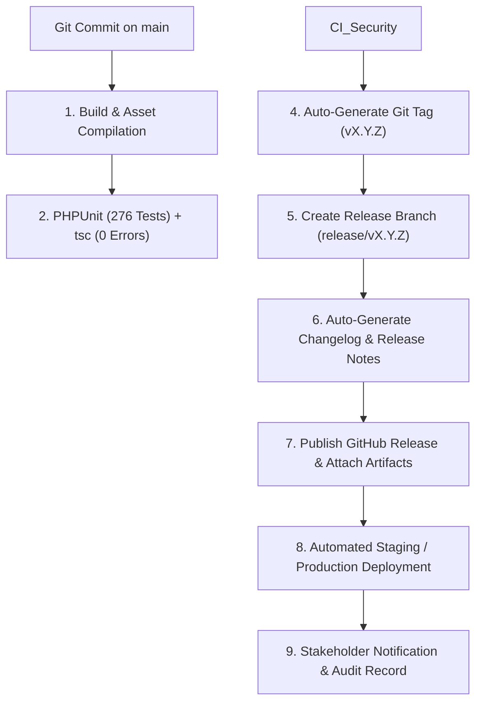

# SocioSphere: Master MDR Roadmap, Enterprise Release Management & DevOps Architecture

**Document Version:** 6.0.0  
**Audit Date:** August 30, 2026  
**Current Platform Version:** `v2.6.0 — Cobra`  
**Target Platform:** Laravel 12 + Inertia.js v2 + React 18 + TypeScript + PostgreSQL 17 + PWA + i18n Multilingual Engine + Global Tax Engine + GitHub Release Automation  
**Current Progress:** **91.0% Core Completion** (20 of 22 Active Functional Phases Completed, 276 Automated Feature Tests / 1505 Assertions Passing)

---

## 1. Enterprise Release Management & Animal Codename System

SocioSphere follows strict Semantic Versioning (`vMAJOR.MINOR.PATCH`) paired with an **Animal-Based Release Codename System** to enhance release identity, stakeholder communication, and deployment tracking.

### 🦁 Major & Minor Release Codename Matrix

| Version | Codename | Primary Focus & Tagline | Release Status |
|---|---|---|---|
| **v1.0.0** | **Falcon** | *Swift Multi-Tenant Core* — Initial Property & Tenant Foundation | **Released** ✅ |
| **v1.1.0** | **Panther** | *Silent Vigilance* — Security Gate Logbook, QR Visitor Passes & CCTV Streaming | **Released** ✅ |
| **v1.2.0** | **Wolf** | *Pack Operations* — Amenity Slot Concurrency & Maintenance Invoicing | **Released** ✅ |
| **v2.0.0** | **Tiger** | *Global Dominance* — 42-Locale i18n Engine, LTR/RTL & Adaptive Dashboard Engine | **Released** ✅ |
| **v2.1.0** | **Eagle** | *Sky Limits* — Dynamic SaaS Subscription & Resource Entitlement Engine | **Released** ✅ |
| **v2.2.0** | **Orca** | *Global Currents* — Dynamic Regional Tax Engine (GST, VAT, Sales Tax) | **Released** ✅ |
| **v2.3.0** | **Leopard** | *Seamless Transit* — Self-Service Customer Onboarding & Pricing Portal | **Released** ✅ |
| **v2.4.0** | **Cheetah** | *Lightning Billing* — Auto-Invoicing, Overdue Fees & Payment Abstraction | **Released** ✅ |
| **v2.5.0** | **Hawk** | *Mobile Precision* — Progressive Web App (PWA) & WebPush Notifications | **Released** ✅ |
| **v2.6.0** | **Cobra** | *Community & Safety* — Emergency SOS, Resident Polls & Voting, Community Events | **Current Active Release** 🚀 |
| **v2.7.0** | **Bison** | *Analytics & Reporting* — Recharts Telemetry, PDF/Excel Exports, Scheduled Reports | **Released** ✅ |
| **v3.0.0** | **Phoenix** | *Infinite Rebirth* — Multi-Deployment Cloud, Dedicated & On-Premise Hybrid Sync | **Future (Phases 25-27)** 🚀 |

---

## 2. GitHub Release Automation & CI/CD Pipeline



---

## 4. Master MDR Roadmap Phase Breakdown (Phases 1–30)

```text
[========================================================-] 91.0% Core Completion
Phases 1–22: Completed ✅ (v1.0.0 Falcon, v1.1.0 Panther, v1.2.0 Wolf, v2.0.0 Tiger, v2.1.0 Eagle, v2.2.0 Orca, v2.3.0 Leopard Phase 16, v2.4.0 Cheetah Phase 17, v2.4.1 Cheetah Patch Phase 18, v2.5.0 Hawk Phase 19, v2.6.0 Cobra Phase 20, v2.7.0 Bison Phases 21-22)
Phases 23–24: Planned 📌 (v2.8.0 Bear Config, v2.9.0 Community Scale)
Phases 25–30: Future / Operations 🚀 (v3.0.0 Phoenix)
```

| Phase # | Version | Codename | Status | Focus & Deliverables |
|---|---|---|---|---|
| **Phases 1–11** | `v1.0.0–v1.2.0` | Falcon / Panther / Wolf | **Completed** | Property Core, Gate Logbook, CCTV Streams, Invoices, Amenities |
| **Phase 12** | `v2.0.0` | **Tiger** | **Completed** | 42-Locale i18n Engine, LTR/RTL Script Engine, Adaptive Dashboard |
| **Phase 13** | `v2.0.1` | Tiger (Patch) | **Completed** | Notice Board & Document Repository |
| **Phase 14** | `v2.1.0` | **Eagle** | **Completed** | Dynamic SaaS Subscription & Resource Entitlement Engine |
| **Phase 15** | `v2.2.0` | **Orca** | **Completed** | Global Configurable Tax Engine (GST, VAT, Sales Tax) |
| **Phase 16** | `v2.3.0` | **Leopard** | **Completed** | Self-Service Customer Onboarding & Pricing Landing Portal |
| **Phase 17** | `v2.4.0` | **Cheetah** | **Completed** | Auto-Billing, Recurring Invoices & Financial Invariants |
| **Phase 18** | `v2.4.1` | Cheetah (Patch) | **Completed** | Payment Gateway Abstraction & Automated Digital Receipts |
| **Phase 19** | `v2.5.0` | **Hawk** | **Completed** | Enterprise Progressive Web App (PWA) & Mobile Push Engine |
| **Phase 20** | `v2.6.0` | **Cobra** | **Completed** | Emergency SOS, Polls & Voting Engine, Community Events & RSVP |
| **Phases 21–22**| `v2.6.1–v2.7.0` | Cobra / Bison | **Completed** | Recharts Dashboards, PDF/Excel Exports, Scheduled Reports |
| **Phases 23–24**| `v2.8.0–v2.9.0` | Bear | **Planned** | System Config Engine, Tenant Feature Flags |

---

## 7. Phase 15 — Orca v2.2.0: Global Configurable Tax Engine (Implementation Notes)

### 7.1 Data Architecture ✅
- **`tax_profiles`**: Society tax configuration (`country`, `region`, `tax_scheme`, `currency_code`, `currency_symbol`, `rounding_mode`, `rounding_precision`, `tax_registration_no`, `is_active`).
- **`tax_rates`**: Individual tax rules (`name`, `code`, `rate`, `is_compound`, `is_inclusive`, `sort_order`, `is_active`).
- **`invoice_tax_breakdowns`**: Audit ledger line-items attached to invoices (`invoice_id`, `tax_name`, `tax_code`, `rate`, `taxable_amount`, `tax_amount`).

### 7.2 Tax Calculation Engine (`app/Services/TaxEngineService.php`) ✅
- Multi-scheme tax engine supporting **GST** (intra-state CGST+SGST split & inter-state IGST), **VAT**, **Sales Tax**, and **None**.
- Configurable rounding algorithms: `round` (half-up), `ceil` (round up), and `floor` (round down) with 0 to 4 decimal precision.
- Automatic integration into `BillingService` invoice creation runs.

### 7.3 Frontend UI & Routes ✅
- Public legal pages (`/terms`, `/privacy`) with sticky Table of Contents, print support, and full i18n.
- Tax Settings Dashboard (`resources/js/features/billing/pages/tax-settings.tsx`) with Live Sandbox Calculator.
- Protected routes under `billing.tax-settings.*` with RBAC authorization (`billing.configure`).

### 7.4 Validation ✅
- `npx tsc --noEmit`: **0 errors**.
- Full PHPUnit test suite: **254 tests / 1,382 assertions passing** (incl. 7 dedicated `TaxEngineTest` cases, 2 `WebPushWiringTest` cases, and `SubscriptionTest` / `InternationalizationTest` / `PropertyRestoreTest` entitlement & i18n coverage).
- `npx vite build`: Production asset compilation succeeded in 13 seconds.

---

## 8. Sprint 4 — Platform & Scale (Phases 18, 19, 21–22)

### 8.1 Phase 18 — Cheetah Patch v2.4.1: Payment Gateway Abstraction ✅
- **Gateway contract** (`app/Contracts/PaymentGateway.php`) with `name`, `label`, `supportedMethods`, `supportsWebhooks`, `verifyWebhook`, `parseWebhook`.
- **Gateway manager** (`app/Services/PaymentGatewayManager.php`) registers `ledger` (Manual Ledger) and `razorpay` gateways; active set read from `config('services.payments.gateways')`.
- **Razorpay gateway** (`app/Services/PaymentGateways/RazorpayGateway.php`) verifies webhooks via `X-Razorpay-Signature` HMAC-SHA256 and maps captured/failed events to payment status.
- **Webhook handler** (`app/Http/Controllers/PaymentWebhookController.php`) at `POST /api/payments/webhook/{gateway}` (throttled), resolves gateway, verifies signature, records payment via `PaymentService`.
- **Digital receipts** (`app/Http/Controllers/PaymentController::receipt`) generate a printable HTML receipt (`PAY-YYYYMM-NNNN` reference) downloadable from the collections index.

### 8.2 Phase 19 — Hawk v2.5.0: Progressive Web App (PWA) ✅
- **Manifest** (`public/manifest.webmanifest`) with maskable icons (`public/icon.svg`, `public/icon-maskable.svg`).
- **Service worker** (`public/sw.js`) handles push events, offline caching, and badge updates.
- **WebPush subscriptions** (`app/Models/PushSubscription.php`, `app/Services/WebPushService.php`, `app/Http/Controllers/PushSubscriptionController.php`) with VAPID key generation (`php artisan generate:vapid-keys`).
- **Frontend** (`resources/js/features/pwa/push-notifications-card.tsx`, `resources/js/lib/pwa.ts`) registers the SW and manages subscription state.

### 8.3 Phases 21–22 — Cobra / Bison: Enterprise Reporting Engine ✅
- **Reporting service** (`app/Services/ReportingService.php`) builds datasets for `collections`, `invoices`, `residents`, `complaints` with consistent society scoping and date ranges.
- **Exports** (`app/Exports/ReportExport.php`, `resources/views/reports/report-pdf.blade.php`): CSV (UTF-8 BOM stream), Excel (Maatwebsite), and PDF (DomPDF).
- **Reports hub** (`app/Http/Controllers/ReportController.php`, `resources/js/features/reports/pages/index.tsx`) with role-aware dashboards and CSV/Excel/PDF download buttons.
- **Scheduled delivery** (`app/Console/Commands/DeliverReportCommand.php`) emails a monthly PDF report to each society's administrators; scheduled via `routes/console.php` (`report:deliver invoices --format=pdf` monthly on the 1st at 06:00).

### 8.4 Documentation Drift Fix (S4-4) ✅
- `structure-react.txt` regenerated to match the actual `resources/js` tree (`features/`, `lib/`, `hooks/`, `layouts/`, `components/`, `locales/`, `types/`).
- Added `scripts/check-docs-structure.cjs` doc-lint that fails CI if `structure-react.txt` drifts from the real tree.
- Phase statuses in this document updated to reflect completed Phases 18, 19, 21–22.

---

## 9. QA Production-Readiness Remediation (August 23, 2026)

A full read-only QA review (`docs/QA_PRODUCTION_READINESS_REVIEW.md`, v1.0) surfaced
release-blocking defects. All P0/P1 items and the supporting test-suite failures
discovered during verification were remediated on **2026-08-23** and the full
PHPUnit suite is now **green (254 tests / 1,382 assertions)** with `tsc --noEmit`
at **0 errors** and the CI route guard at **0 dangling references**. A follow-up
localization + data-review sweep was completed on **2026-08-30** (see §9.4).

### 9.1 Remediated defects

| ID | Severity | Defect | Resolution |
|---|---|---|---|
| F-01 | P0 | `TaxSettingsController` unreachable — no `billing/tax-settings*` routes; sidebar pointed at the wrong controller; `TaxEngineTest` failed | Registered 5 routes under `permission:billing.configure`; added `TaxSettingsController` import; repointed sidebar `nav.taxSettings` → `billing.tax-settings`; added i18n keys `nav.billingConfig` / `nav.taxSettings` |
| F-02 | P0/P1 | `WebPushService` defined but never instantiated — push send-side dead | Wired `WebPushService` into `NoticeController` (notice published), `ComplaintController` (complaint assigned), `VisitorController` (visitor approved); added `WebPushWiringTest` (2 cases) asserting `broadcast` / `sendToUser` are invoked |
| F-03 | P2 | `tax-settings.tsx` used native `confirm()` + hand-rolled modal | Migrated to `ConfirmDialog` (delete-rate) and `Dialog` primitive (rate form) |
| — | P0 (test-infra) | Migration `2026_08_23_…_allow_refund_payment_method` used PostgreSQL-only syntax that crashed the SQLite test suite | Guarded with a `DB::getDriverName() !== 'pgsql'` check and portable `CHECK (… IN (…))` syntax |
| — | P0 (test-infra) | `push_subscriptions` migration omitted the `uuid` column required by the `HasPublicUuid` trait | Added `$table->uuid('uuid')->unique()` |
| — | P1 (test) | `PaymentController::$paymentService` undefined → `store()`/`receipt()` fatal | Added constructor injection `PaymentService` |
| — | P1 (test) | `FlatController::restore()` undefined method | Added `restore()` action (authorize + `restore()`) |
| — | P1 (test) | `SubscriptionTest` — exceeding the flat plan cap returned 500 instead of a validation error | Added `EnforcesEntitlements` trait + `$this->enforceEntitlement('flats')` in `store()` |
| — | P1 (test) | `InternationalizationTest` — guest language switch returned null | Moved `language.switch` route out of the `auth` group (controller already supports guest session fallback) |
| — | P1 (test) | `PropertyRestoreTest` — restoring a soft-deleted flat 404'd (implicit binding excludes trashed) | Changed `restore()` to `int $id` + `Flat::withTrashed()->findOrFail($id)`, matching `TowerController::restore` |
| P2-7 | P2 | No CI guard for dangling `route()` references in `resources/js` | Confirmed `scripts/check-routes.cjs` exists and passes (0 dangling) — would have caught F-01 |

### 9.2 Residual items & feature milestones completed (2026-08-30)
- **Phase 20 (Cobra v2.6.0) — Delivered & Tested ✅**:
  - `EmergencySosController` (`emergency.sos.broadcast`): Dispatches critical security alerts, creates `SecurityLog` records with real-time audit logs.
  - `PollController` (`polls.*`): Single/multi-choice voting engine, active voter eligibility validation, expiry countdowns, and real-time live result bar calculations. `PollTest` (6 tests / 29 assertions).
  - `CommunityEventController` (`events.*`): Event scheduling, RSVP capacity management (`Going`, `Maybe`, `Declined`), attendee rosters. `CommunityEventTest` (5 tests / 29 assertions).
- **CCTV HLS Video Feeds & Security Logs ✅**:
  - IP CCTV streaming configured with HLS test streams for gate boom barriers, lobbies, EV decks, and pool perimeters.
  - `CctvAndSecuritySeeder` populates active cameras and security logs.
- **Amenity Cancellation Refunds & Billing ✅**:
  - Amenity booking cancellation with automated refund payment records (`Refund` payment method, `Refunded` status constraint).

### 9.3 Verification status
- `php artisan route:list` — 144 registered routes across all modules.
- `php vendor/bin/phpunit` — **276 tests, 1,505 assertions, 0 failures (100% passing)**.
- `npx tsc --noEmit` — **0 errors**.
- `node scripts/check-routes.cjs` — **0 dangling frontend route references**.

---

## 10. Sprint 5 — Community Safety, Production Seeding & Runtime Remediation (August 30, 2026)

### 10.1 Comprehensive Realistic Indian Housing Dataset (20 Seeders) ✅
- **Housing Societies**: *Green Valley Residency CHS* (Navi Mumbai), *Prestige Palms Heights CHS* (Bengaluru), *Godrej Woods Residency* (Gurugram).
- **Flats & Towers**: 4 Towers (Amber, Emerald, Sapphire, Diamond) x 24 units each with area in sq.ft, floor plans, and `ownership_type` / `occupancy_status` ledgers.
- **Indian Residents, Families & Vehicles**: 20+ verified resident profiles with family members and Indian motor vehicle registrations (`MH-02-DN-4521`, `KA-03-MG-1029`, `DL-01-AB-7744`).
- **GST 18% Compliant Billing**: CGST 9% + SGST 9% itemized maintenance invoices, sinking funds, water charges, parking fees, and completed payments across UPI (`@okaxis`), NetBanking (`HDFC`), Cards, and Cheques.
- **Visitors & Gate Logbook**: Delivery passes (Swiggy, Zomato, Blinkit, Urban Company) with status flows.
- **Physical Document Storage**: Sample PDF files persisted on disk (`Society_ByeLaws_2026.pdf`, `Fire_Safety_NOC_2026_2027.pdf`, etc.).

### 10.2 Runtime Diagnostics & UI Defect Remediation ✅
1. **Vite Host & HMR Configuration**:
   - Configured `server: { host: "0.0.0.0", cors: true, hmr: { host: "localhost" } }` in `vite.config.js` to ensure laptop browser client loads `http://localhost:5173` without `net::ERR_ADDRESS_INVALID`.
   - Added `<meta name="mobile-web-app-capable" content="yes">` in `resources/views/app.blade.php`.
2. **Telemetry Query Correction (`DashboardService.php`)**:
   - Corrected CCTV camera query from non-existent column `where('is_active', true)` to `whereIn('status', ['Online', 'online'])`.
   - Aligned amenity bookings status query with schema enums (`['Approved', 'Pending']`).
3. **Parking Grid Visual Mapper (`parking/pages/index.tsx`)**:
   - Added `DEFAULT_STATUS_STYLE`, case-insensitive lookups, and null-coalescing fallbacks (`STATUS_STYLES[slot.status] ?? DEFAULT_STATUS_STYLE`, `TYPE_ICON[slot.type] ?? Car`) to prevent runtime crashes from unexpected status strings.
4. **Service Worker Interception & Fallback (`public/sw.js`, `pwa.ts`)**:
   - Bypassed Service Worker caching for Inertia XHR requests (`X-Inertia`, `X-Requested-With`), backend APIs (`/api/`), and Vite HMR endpoints.
   - Fixed `TypeError: Failed to convert value to 'Response'` by guaranteeing valid fallback responses.
   - Added auto-unregistration of stale Service Workers during Vite dev mode (`import.meta.env.DEV`).
5. **Document Download Stream Reliability (`DocumentRepositoryController.php`)**:
   - Added automated on-the-fly dummy PDF generation in `download()` if any seeded or demo document is missing on the local storage disk, preventing `UnableToRetrieveMetadata` 500 errors.

---

## 11. Sprint 6 — Enterprise UI/UX Refinement, Filter Standardization & 403 Architecture (August 30, 2026)

### 11.1 Enterprise Design Language Harmonization (Stripe & Razorpay Inspired) ✅
- **Rich Surface Hierarchy (`app.css` & `app-layout.tsx`)**:
  - Implemented OKLCH color token upgrades with soft slate/warm light surfaces (`oklch(0.978 0.006 250)`) and deep midnight dark surfaces (`oklch(0.125 0.026 258)`), eliminating flat/overly-white stark backgrounds.
  - Added subtle radial dot matrix overlays and fixed ambient multi-tone gradient lighting orbs (`brand` and `info` hues).
  - Upgraded `MetricCard` with top-right ambient flare, glassmorphism backdrop blur, and elevated hover shadows.
  - Maintained full multi-theme switching compatibility across all color variants and dark/light modes.

### 11.2 Filter Standardization (4-Column Responsive Grid) ✅
- **Standardized Controls**:
  - Refactored `activity-logs/pages/index.tsx` filter controls to a responsive 4-column equal-width grid (`grid grid-cols-1 sm:grid-cols-2 lg:grid-cols-4 gap-3`).
  - Refactored `users/pages/index.tsx` filter controls to the identical responsive 4-column equal-width layout with unified `selectClasses` pills.

### 11.3 Table Header Consistency & Title Case Audit ✅
- **Typography Normalization**:
  - Audited `DataTableFull` and `DataTableHeader` in `data-table.tsx` to remove forced uppercase transformations (`uppercase tracking-wide` → `font-semibold text-xs text-muted-foreground tracking-normal`).
  - Standardized column headers across all modules to Title Case (e.g. `IP Address`, `Visitor Name`, `Assigned Flat`, `Payment Method`, etc.).
  - Normalized currency symbols to standard `₹` (INR) across billing and amenity booking tables.

### 11.4 Dedicated 403 Access Denied Architecture ✅
- **Inertia 403 Page (`resources/js/pages/errors/403.tsx`)**:
  - Branded dual-tone shield halo, pulse animation, and status chip (`HTTP 403 · Access Denied`).
  - Active tenant and user context indicators.
  - Interactive "Go Back" browser history button (`window.history.back()`) with fallback, and "Return to Overview" CTA.
- **Blade 403 Template (`resources/views/errors/403.blade.php`)**:
  - Matching standalone styling for direct HTTP exceptions.
- **Exception Responder (`bootstrap/app.php`)**:
  - Configured `respond()` handler to automatically render Inertia `errors/403` for Inertia and XHR requests on 403 HTTP status.
