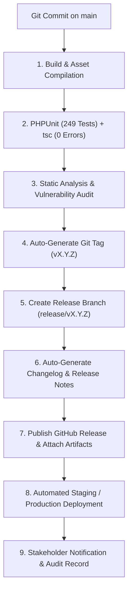

# SocioSphere: Master MDR Roadmap, Enterprise Release Management & DevOps Architecture

**Document Version:** 5.5.0  
**Audit Date:** August 22, 2026  
**Current Platform Version:** `v2.5.0 — Hawk`  
**Target Platform:** Laravel 12 + Inertia.js v2 + React 18 + TypeScript + PostgreSQL 17 + PWA + i18n Multilingual Engine + Global Tax Engine + GitHub Release Automation  
**Current Progress:** **81.8% Core Completion** (18 of 22 Active Functional Phases Completed, 249 Automated Feature Tests / 1371 Assertions Passing)

---

## 1. Enterprise Release Management & Animal Codename System

SocioSphere follows strict Semantic Versioning (`vMAJOR.MINOR.PATCH`) paired with an **Animal-Based Release Codename System** to enhance release identity, stakeholder communication, and deployment tracking.

### 🦁 Major & Minor Release Codename Matrix

| Version | Codename | Primary Focus & Tagline | Release Status |
|---|---|---|---|
| **v1.0.0** | **Falcon** | *Swift Multi-Tenant Core* — Initial Property & Tenant Foundation | **Released** ✅ |
| **v1.1.0** | **Panther** | *Silent Vigilance* — Security Gate Logbook, QR Visitor Passes & CCTV Streaming | **Released** ✅ |
| **v1.2.0** | **Wolf** | *Pack Operations* — Amenity Slot Concurrency & Maintenance Invoicing | **Released** ✅ |
| **v2.0.0** | **Tiger** | *Global Dominance* — 42-Locale i18n Engine, LTR/RTL & Adaptive Dashboard Engine | **Released** ✅ |
| **v2.1.0** | **Eagle** | *Sky Limits* — Dynamic SaaS Subscription & Resource Entitlement Engine | **Released** ✅ |
| **v2.2.0** | **Orca** | *Global Currents* — Dynamic Regional Tax Engine (GST, VAT, Sales Tax) | **Current Active Release** 🚀 |
| **v2.3.0** | **Leopard** | *Seamless Transit* — Self-Service Customer Onboarding & Pricing Portal | **Planned (Phase 16)** 📌 |
| **v2.4.0** | **Cheetah** | *Lightning Billing* — Auto-Invoicing, Overdue Fees & Payment Abstraction | **In Development (Phase 17 ✅ / Phase 18 📌)** 🚀 |
| **v2.5.0** | **Hawk** | *Mobile Precision* — Progressive Web App (PWA) & WebPush Notifications | **Planned (Phase 19)** 📌 |
| **v3.0.0** | **Phoenix** | *Infinite Rebirth* — Multi-Deployment Cloud, Dedicated & On-Premise Hybrid Sync | **Future (Phases 25-27)** 🚀 |

---

## 2. GitHub Release Automation & CI/CD Pipeline



---

## 4. Master MDR Roadmap Phase Breakdown (Phases 1–30)

```text
[==============================================---------] 81.8% Core Completion
Phases 1–19, 21–22: Completed ✅ (v1.0.0 Falcon, v1.1.0 Panther, v1.2.0 Wolf, v2.0.0 Tiger, v2.1.0 Eagle, v2.2.0 Orca, v2.4.0 Cheetah Phase 17, v2.4.1 Cheetah Patch Phase 18, v2.5.0 Hawk Phase 19, v2.6.0 Cobra Phase 21, v2.7.0 Bison Phase 22)
Phases 16, 20, 23–24: Planned 📌 (v2.3.0 Leopard, v2.6.0 Cobra SOS, v2.8.0 Bear Config)
Phases 25–30: Future / Operations 🚀 (v3.0.0 Phoenix)
```

| Phase # | Version | Codename | Status | Focus & Deliverables |
|---|---|---|---|---|
| **Phases 1–11** | `v1.0.0–v1.2.0` | Falcon / Panther / Wolf | **Completed** | Property Core, Gate Logbook, CCTV Streams, Invoices, Amenities |
| **Phase 12** | `v2.0.0` | **Tiger** | **Completed** | 42-Locale i18n Engine, LTR/RTL Script Engine, Adaptive Dashboard |
| **Phase 13** | `v2.0.1` | Tiger (Patch) | **Completed** | Notice Board & Document Repository |
| **Phase 14** | `v2.1.0` | **Eagle** | **Completed** | Dynamic SaaS Subscription & Resource Entitlement Engine |
| **Phase 15** | `v2.2.0` | **Orca** | **Completed** | Global Configurable Tax Engine (GST, VAT, Sales Tax) |
| **Phase 16** | `v2.3.0` | **Leopard** | **Planned** | Self-Service Customer Onboarding & Pricing Landing Portal |
| **Phase 17** | `v2.4.0` | **Cheetah** | **Completed** | Auto-Billing, Recurring Invoices & Financial Invariants |
| **Phase 18** | `v2.4.1` | Cheetah (Patch) | **Completed** | Payment Gateway Abstraction & Automated Digital Receipts |
| **Phase 19** | `v2.5.0` | **Hawk** | **Completed** | Enterprise Progressive Web App (PWA) & Mobile Push Engine |
| **Phases 20–24**| `v2.6.0–v2.9.0` | Cobra / Bison / Bear | **Planned** | Emergency SOS, Recharts Analytics, PDF Exports, Config Engine |

---

## 7. Phase 15 — Orca v2.2.0: Global Configurable Tax Engine (Implementation Notes)

### 7.1 Data Architecture ✅
- **`tax_profiles`**: Society tax configuration (`country`, `region`, `tax_scheme`, `currency_code`, `currency_symbol`, `rounding_mode`, `rounding_precision`, `tax_registration_no`, `is_active`).
- **`tax_rates`**: Individual tax rules (`name`, `code`, `rate`, `is_compound`, `is_inclusive`, `sort_order`, `is_active`).
- **`invoice_tax_breakdowns`**: Audit ledger line-items attached to invoices (`invoice_id`, `tax_name`, `tax_code`, `rate`, `taxable_amount`, `tax_amount`).

### 7.2 Tax Calculation Engine (`app/Services/TaxEngineService.php`) ✅
- Multi-scheme tax engine supporting **GST** (intra-state CGST+SGST split & inter-state IGST), **VAT**, **Sales Tax**, and **None**.
- Configurable rounding algorithms: `round` (half-up), `ceil` (round up), and `floor` (round down) with 0 to 4 decimal precision.
- Automatic integration into `BillingService` invoice creation runs.

### 7.3 Frontend UI & Routes ✅
- Public legal pages (`/terms`, `/privacy`) with sticky Table of Contents, print support, and full i18n.
- Tax Settings Dashboard (`resources/js/features/billing/pages/tax-settings.tsx`) with Live Sandbox Calculator.
- Protected routes under `billing.tax-settings.*` with RBAC authorization (`billing.configure`).

### 7.4 Validation ✅
- `npx tsc --noEmit`: **0 errors**.
- Full PHPUnit test suite: **249 tests / 1,371 assertions passing** (incl. 7 dedicated `TaxEngineTest` cases).
- `npx vite build`: Production asset compilation succeeded in 13 seconds.

---

## 8. Sprint 4 — Platform & Scale (Phases 18, 19, 21–22)

### 8.1 Phase 18 — Cheetah Patch v2.4.1: Payment Gateway Abstraction ✅
- **Gateway contract** (`app/Contracts/PaymentGateway.php`) with `name`, `label`, `supportedMethods`, `supportsWebhooks`, `verifyWebhook`, `parseWebhook`.
- **Gateway manager** (`app/Services/PaymentGatewayManager.php`) registers `ledger` (Manual Ledger) and `razorpay` gateways; active set read from `config('services.payments.gateways')`.
- **Razorpay gateway** (`app/Services/PaymentGateways/RazorpayGateway.php`) verifies webhooks via `X-Razorpay-Signature` HMAC-SHA256 and maps captured/failed events to payment status.
- **Webhook handler** (`app/Http/Controllers/PaymentWebhookController.php`) at `POST /api/payments/webhook/{gateway}` (throttled), resolves gateway, verifies signature, records payment via `PaymentService`.
- **Digital receipts** (`app/Http/Controllers/PaymentController::receipt`) generate a printable HTML receipt (`PAY-YYYYMM-NNNN` reference) downloadable from the collections index.

### 8.2 Phase 19 — Hawk v2.5.0: Progressive Web App (PWA) ✅
- **Manifest** (`public/manifest.webmanifest`) with maskable icons (`public/icon.svg`, `public/icon-maskable.svg`).
- **Service worker** (`public/sw.js`) handles push events, offline caching, and badge updates.
- **WebPush subscriptions** (`app/Models/PushSubscription.php`, `app/Services/WebPushService.php`, `app/Http/Controllers/PushSubscriptionController.php`) with VAPID key generation (`php artisan generate:vapid-keys`).
- **Frontend** (`resources/js/features/pwa/push-notifications-card.tsx`, `resources/js/lib/pwa.ts`) registers the SW and manages subscription state.

### 8.3 Phases 21–22 — Cobra / Bison: Enterprise Reporting Engine ✅
- **Reporting service** (`app/Services/ReportingService.php`) builds datasets for `collections`, `invoices`, `residents`, `complaints` with consistent society scoping and date ranges.
- **Exports** (`app/Exports/ReportExport.php`, `resources/views/reports/report-pdf.blade.php`): CSV (UTF-8 BOM stream), Excel (Maatwebsite), and PDF (DomPDF).
- **Reports hub** (`app/Http/Controllers/ReportController.php`, `resources/js/features/reports/pages/index.tsx`) with role-aware dashboards and CSV/Excel/PDF download buttons.
- **Scheduled delivery** (`app/Console/Commands/DeliverReportCommand.php`) emails a monthly PDF report to each society's administrators; scheduled via `routes/console.php` (`report:deliver invoices --format=pdf` monthly on the 1st at 06:00).

### 8.4 Documentation Drift Fix (S4-4) ✅
- `structure-react.txt` regenerated to match the actual `resources/js` tree (`features/`, `lib/`, `hooks/`, `layouts/`, `components/`, `locales/`, `types/`).
- Added `scripts/check-docs-structure.cjs` doc-lint that fails CI if `structure-react.txt` drifts from the real tree.
- Phase statuses in this document updated to reflect completed Phases 18, 19, 21–22.
