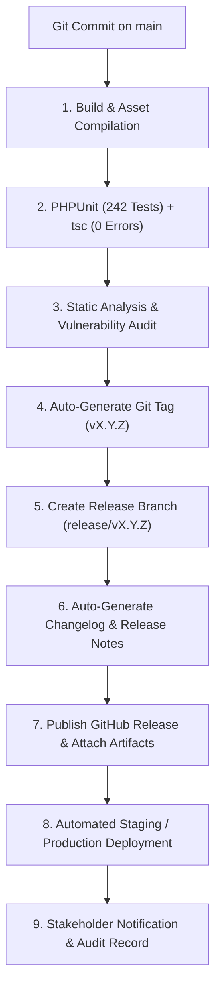

# SocioSphere: Master MDR Roadmap, Enterprise Release Management & DevOps Architecture

**Document Version:** 5.3.0  
**Audit Date:** August 16, 2026  
**Current Platform Version:** `v2.1.0 — Eagle`  
**Target Platform:** Laravel 12 + Inertia.js v2 + React 18 + TypeScript + PostgreSQL 17 + PWA + i18n Multilingual Engine + GitHub Release Automation  
**Current Progress:** **68.2% Core Completion** (15 of 22 Active Functional Phases Completed, 242 Automated Feature Tests / 1337 Assertions Passing)

---

## 1. Enterprise Release Management & Animal Codename System

SocioSphere follows strict Semantic Versioning (`vMAJOR.MINOR.PATCH`) paired with an **Animal-Based Release Codename System** to enhance release identity, stakeholder communication, and deployment tracking.

### 🦁 Major & Minor Release Codename Matrix

| Version | Codename | Primary Focus & Tagline | Release Status |
|---|---|---|---|
| **v1.0.0** | **Falcon** | *Swift Multi-Tenant Core* — Initial Property & Tenant Foundation | **Released** ✅ |
| **v1.1.0** | **Panther** | *Silent Vigilance* — Security Gate Logbook, QR Visitor Passes & CCTV Streaming | **Released** ✅ |
| **v1.2.0** | **Wolf** | *Pack Operations* — Amenity Slot Concurrency & Maintenance Invoicing | **Released** ✅ |
| **v2.0.0** | **Tiger** | *Global Dominance* — 42-Locale i18n Engine, LTR/RTL & Adaptive Dashboard Engine | **Released** ✅ |
| **v2.1.0** | **Eagle** | *Sky Limits* — Dynamic SaaS Subscription & Resource Entitlement Engine | **Current Active Release** 🚀 |
| **v2.2.0** | **Orca** | *Global Currents* — Dynamic Regional Tax Engine (GST, VAT, Sales Tax) | **Planned (Phase 15)** 📌 |
| **v2.3.0** | **Leopard** | *Seamless Transit* — Self-Service Customer Onboarding & Pricing Portal | **Planned (Phase 16)** 📌 |
| **v2.4.0** | **Cheetah** | *Lightning Billing* — Auto-Invoicing, Overdue Fees & Payment Abstraction | **In Development (Phase 17 ✅ / Phase 18 📌)** 🚀 |
| **v2.5.0** | **Hawk** | *Mobile Precision* — Progressive Web App (PWA) & WebPush Notifications | **Planned (Phase 19)** 📌 |
| **v3.0.0** | **Phoenix** | *Infinite Rebirth* — Multi-Deployment Cloud, Dedicated & On-Premise Hybrid Sync | **Future (Phases 25-27)** 🚀 |

---

## 2. GitHub Release Automation & CI/CD Pipeline



### GitHub CI/CD Pipeline Stages

1. **Build & Lint**: Asset compilation (`vite build`), TypeScript validation (`tsc --noEmit`), and ESLint checks.
2. **Automated Testing**: Full execution of PHPUnit feature test suite (**242 tests / 1,337 assertions**).
3. **Static Analysis & Security Scan**: Security vulnerability audit (`composer audit`, `npm audit`), SAST code scanner.
4. **Semantic Versioning & Release Branch**: Automatic calculation of next SemVer increment, git tag creation (`v2.0.0`), and release branch checkout (`release/v2.0.0`).
5. **Changelog & Release Notes Generation**: Parsing conventional commits into categorized markdown sections:
   - 🚀 New Features
   - ⚡ Improvements
   - 🐛 Bug Fixes
   - 🔒 Security Patches
   - ⚠️ Breaking Changes & Database Migrations
6. **Artifact Publishing**: Attachment of compiled production assets (`sociosphere-v2.0.0.tar.gz`), Docker image digest, and OpenAPI spec to GitHub Release.
7. **Deployment & Metadata Recording**: Recording deployment metadata in `deployment_history` table (`git_commit`, `git_tag`, `build_number`, `deployed_by`, `environment`).

---

## 3. Application Version Display & System Info Modal

The application displays the running platform version across all primary footers:

- **Footer Location**: Bottom-right corner of application footer (`SocioSphere v2.0.0 — Tiger`).
- **Login Page Footer**: `SocioSphere Enterprise SaaS v2.0.0 — Tiger`.
- **System Information Modal**: Clicking the version badge opens the **System Release Info Modal**:
  - Version & Codename (`v2.0.0 — Tiger`)
  - Build Date & Timestamp (`2026-08-08 01:40 UTC`)
  - Git Commit Hash (`7f3a9e2`)
  - Environment (`Production / Staging`)
  - Database Migration Batch (`Batch 12`)
  - Link to GitHub Release Notes & Changelog

---

## 4. Master MDR Roadmap Phase Breakdown (Phases 1–30)

```text
[====================================-----------------] 68.2% Core Completion
Phases 1–14, 17: Completed ✅ (v1.0.0 Falcon, v1.1.0 Panther, v1.2.0 Wolf, v2.0.0 Tiger, v2.0.1 Tiger Patch, v2.1.0 Eagle, v2.4.0 Cheetah Phase 17)
Phases 15–16, 18–24: Planned 📌 (v2.2.0 Orca through v2.5.0 Hawk)
Phases 25–30: Future / Operations 🚀 (v3.0.0 Phoenix)
```

| Phase # | Version | Codename | Status | Focus & Deliverables |
|---|---|---|---|---|
| **Phases 1–11** | `v1.0.0–v1.2.0` | Falcon / Panther / Wolf | **Completed** | Property Core, Gate Logbook, CCTV Streams, Invoices, Amenities |
| **Phase 12** | `v2.0.0` | **Tiger** | **Completed** | 42-Locale i18n Engine, LTR/RTL Script Engine, Adaptive Dashboard |
| **Phase 13** | `v2.0.1` | Tiger (Patch) | **Completed** | Notice Board & Document Repository |
| **Phase 14** | `v2.1.0` | **Eagle** | **Completed** | Dynamic SaaS Subscription & Resource Entitlement Engine |
| **Phase 15** | `v2.2.0` | **Orca** | **Planned** | Global Configurable Tax Engine (GST, VAT, Sales Tax) |
| **Phase 16** | `v2.3.0` | **Leopard** | **Planned** | Self-Service Customer Onboarding & Pricing Landing Portal |
| **Phase 17** | `v2.4.0` | **Cheetah** | **Completed** | Auto-Billing, Recurring Invoices & Financial Invariants |
| **Phase 18** | `v2.4.1` | Cheetah (Patch) | **Planned** | Payment Gateway Abstraction & Automated Digital Receipts (deferred from Eagle — see §14.6) |
| **Phase 19** | `v2.5.0` | **Hawk** | **Planned** | Enterprise Progressive Web App (PWA) & Mobile Push Engine |
| **Phases 20–24**| `v2.6.0–v2.9.0` | Cobra / Bison / Bear | **Planned** | Emergency SOS, Recharts Analytics, PDF Exports, Config Engine |
| **Phases 25–27**| `v3.0.0` | **Phoenix** | **Future** | Dedicated Cloud, On-Premise K8s/Docker & Hybrid Sync |
| **Phases 28–30**| `v3.1.0` | Phoenix (Ops) | **Planned** | Redis Caching, Security Penetration Matrix, Release Documentation Suite |

---

## 5. Phase 12 — Tiger v2.0.0: Global i18n, LTR/RTL & Adaptive Dashboard (Implementation Notes)

### 5.1 42-Locale i18n Engine ✅

- **42 Global Locales** seeded via `LanguageSeeder` (en default + 41 translations): ar, bn, hi, ur, es, fr, de, pt, it, nl, tr, ru, zh-CN, zh-TW, ja, ko, th, vi, id, ms, fa, he, pl, cs, ro, el, sv, no, da, fi, hu, uk, ta, te, kn, ml, mr, gu, pa, si, ne.
- **Genuine hand-written translations** for all 42 locale JSON files under `resources/js/locales/*.json` — no machine placeholder text. `en.json` is the master catalog; every other locale carries `common.*`, `menu.*`, `auth.*`, and `dashboard.*` keys with per-language phrasing, date/number formatting via `Intl`.
- **Client i18n engine** (`resources/js/lib/i18n.tsx`): eager `import.meta.glob` catalog loading, `t(key, params?, locale?)` with `:param` + `{param}` interpolation, `Intl`-based `formatDate/DateTime/Currency/Number`, `I18nProvider` + `useI18n()` hook, module-level fallback so helpers (greeting, timeAgo) work anywhere.
- **Backend locale switch**: invokable `LocaleController` validates locale against active `Language` rows, persists to user + session, `SetLocaleMiddleware` resolves user → session → Accept-Language (5-char tags for zh-CN/zh-TW) → app locale.
- **Role/quick-action key maps** (`roleKey()`, `quickActionKey()`) translate roles and dashboard quick actions at render time.

### 5.2 LTR/RTL Script Direction Engine ✅

- `script_dir` flag on `Language` model; **4 RTL locales**: `ar`, `ur`, `fa`, `he`.
- `I18nProvider` sets `document.documentElement.dir` / `lang` / `data-dir` on locale switch; `useI18n().isRTL` available to components for mirrored layouts.
- Verified via `InternationalizationTest`: exactly 42 languages seeded and exactly 4 RTL script directions.

### 5.3 Adaptive Dashboard Engine ✅

- Fully translated adaptive dashboard (`dashboard-page.tsx`): role-aware greeting, metric cards, occupancy analysis, priority matrix, quick operations, and 9-item quick-action registry — all driven by `t()` lookups.
- Auth pages (login, register, password reset, email verification), auth branding, app sidebar, notification center, page header, and command palette fully internationalized.

### 5.4 Validation ✅

- `npx tsc --noEmit`: **0 errors**.
- Full PHPUnit suite: **242 tests / 1,337 assertions passing** (incl. 5 dedicated `InternationalizationTest` cases).
- `npx vite build`: production build succeeds.
- InternationalizationTest coverage: 42-locale seed + 4 RTL check, guest redirect on switch, Laravel app locale set, user context persistence, unsupported-locale rejection.

---

## 6. Phase 14 — Eagle v2.1.0: Dynamic SaaS Subscription & Resource Entitlement Engine (Implementation Notes)

### 6.1 Data Model ✅

Three new tables (migration batch applied 2026-08-16):

- **`subscription_plans`** — platform-wide plan catalog (NOT society-scoped): `uuid`, `name`, `code` (unique), `description`, `price_monthly`/`price_yearly` (decimal 10,2), `currency` (default INR), `is_active`, `is_default`, `sort_order`, soft deletes.
- **`subscription_plan_features`** — per-plan entitlement limits: `plan_id` (FK → subscription_plans, cascade), `feature_key`, `limit_value` (**NULL = unlimited**), `sort_order`, unique (`plan_id`, `feature_key`).
- **`subscriptions`** — society lifecycle records: `society_id`, `plan_id` (nullOnDelete), `status` (trialing | active | past_due | cancelled | expired), `billing_cycle` (monthly | yearly), `price`, `currency`, `starts_at`, `trial_ends_at`, `ends_at`, `cancelled_at`, `meta` (JSON), soft deletes, index (`society_id`, `status`).

Models: `SubscriptionPlan`, `SubscriptionPlanFeature`, `Subscription` (deliberately **no** `BelongsToSociety` — read from both society and SuperAdmin contexts; relations pinned to `plan_id`).

### 6.2 Entitlement Engine (`app/Services/EntitlementService.php`) ✅

- **10 countable resources**: towers, flats, residents, users, amenities, documents, notices, cctv_cameras, parking_slots, complaints → mapped to `feature.*` i18n labels.
- `planFor($societyId)`: live subscription plan → falls back to the platform default plan.
- `usage()` counts via `withoutGlobalScopes()` (accurate in SuperAdmin context); `limits()` returns key → int|null (null = unlimited).
- `snapshot($societyId)`: per-feature `{key, label, used, limit, remaining, pct, status}` with status `ok | warn (≥80%) | at (==limit) | over (>limit)`.
- `assertWithinLimit()` throws `ValidationException` with the message *"Subscription limit reached for :feature. Please upgrade your plan to continue."*
- **Enforcement points**: 10 controllers use the `EnforcesEntitlements` trait and call `enforceEntitlement('flats' | 'towers' | ...)` in `store()` — Tower, Flat, Resident, User, Amenity, Notice, DocumentRepository, CctvCamera, ParkingSlot, Complaint.

### 6.3 Subscription Lifecycle (`app/Services/SubscriptionService.php`) ✅

- `activate(Society, Plan, cycle, ?trialDays)`: cancels any existing live subscription (kept for history) then creates a new record (`trialing` when trial > 0 else `active`).
- `changePlan()`, `cancel()` (entitlements continue until period end), `resume()` (trialing again if trial still valid), `syncStatus()` / `syncStatuses()` (trialing → active when trial ends; active → expired when period ends).
- Scheduled daily at **03:00** (`routes/console.php`): `subscriptions:sync` command with output "Checked N subscription(s), updated M.".

### 6.4 Permissions & Roles ✅

- **7 new permissions** (total 83): `plan.view`, `plan.create`, `plan.update`, `plan.delete`, `subscription.view`, `subscription.assign`, `usage.view`.
- **SocietyAdmin + Treasurer**: `subscription.view`, `usage.view`. **SuperAdmin**: full platform administration (via `role:SuperAdmin` route group + policies).
- Policies: `SubscriptionPlanPolicy` (delete blocked on default plan), `SubscriptionPolicy` (cross-society access denied; manage = SuperAdmin or `subscription.assign`).

### 6.5 Routes & Frontend ✅

- Society routes: `subscription.show` (overview), `subscription.usage` (usage dashboard).
- SuperAdmin-only routes: `plans.*` (index/create/store/edit/update/destroy), `subscriptions.index`, `subscriptions.assign` (POST `subscriptions/{society}/assign`), `subscriptions.cancel`, `subscriptions.resume`.
- Frontend pages under `resources/js/features/subscription/pages/`: `overview.tsx`, `usage.tsx`, `admin.tsx`, `plans/index.tsx`, `plans/create.tsx`, `plans/edit.tsx`.
- Sidebar: new `nav.subscription` group (My Subscription, Resource Usage) + platform items (Subscriptions, Plans); 15 new flat i18n keys (`nav.subscription*`, `nav.plans`, `feature.*`) propagated to all 42 locales.

### 6.6 Seed Data & Validation ✅

- `SubscriptionPlanSeeder`: **Starter** (₹0/₹0, default, 10 flats/1 tower/25 residents/5 users caps), **Professional** (₹499/₹4,990, 50 flats/5 towers), **Enterprise** (₹999/₹9,990, all unlimited); activates the default plan for societies without a subscription.
- Factories: `SubscriptionPlanFactory` (with `default()` and `withFeatures()` states), `SubscriptionFactory` (with `trialing()`/`cancelled()`/`expired()`/`yearly()` states).
- `SubscriptionTest` (17 tests / 87 assertions): overview + usage access, guest redirect, resident 403, flat-limit entitlement enforcement (11th flat blocked), SuperAdmin plan assignment/cancel/resume, plans index + create, society-admin 403 on plans, `subscriptions:sync` trial→active and active→expired transitions, and `activate()` cancelling previous live subscription.

### 6.7 Note: Payment Gateway Deferred ✅

The `mdr_roadmap_architecture_and_pwa_audit.md` doc described a Payment Gateway phase (SSLCommerz/Razorpay/Stripe) inside Eagle. Per the master roadmap, this work is **deferred to Phase 18 (v2.4.1 Cheetah Patch)** — auto-billing (Phase 17) already produces invoices; the gateway abstraction will attach digital payment collection on top.

---

## 30. Enterprise Release Documentation Suite (Phase 30)

1. **Release Management Guide**: Semantic versioning policies, tag creation, codename conventions.
2. **Git Branching Strategy**: `main`, `develop`, `feature/*`, `release/*`, `hotfix/*`.
3. **GitHub CI/CD Automation Spec**: GitHub Actions workflow YAML definitions.
4. **Hotfix & Emergency Patch Workflow**: Fast-track hotfix deployment and rollback procedures.
5. **Rollback & Recovery Guide**: Zero-downtime database migration rollback scripts and container rollback.
6. **Deployment Checklist**: Pre-flight verification, smoke tests, and stakeholder notification templates.
