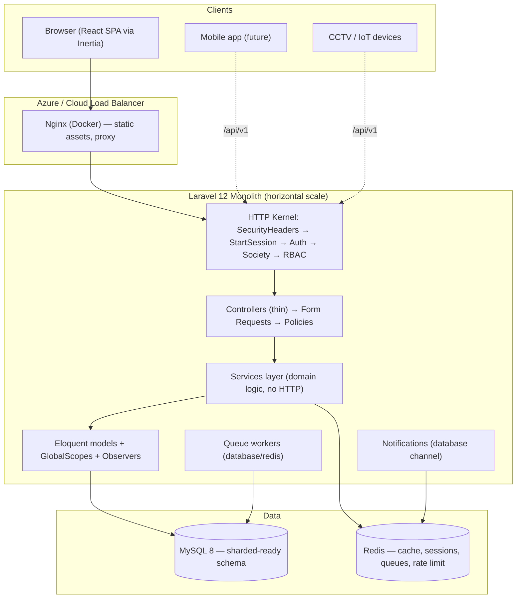
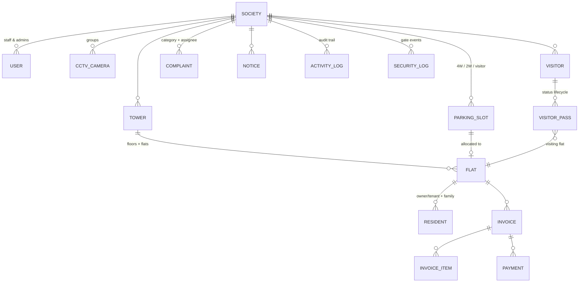

# SocioSphere — Principal Architecture & Implementation Master Plan

**Version:** 1.0 · **Date:** 2026-08-06
**Author:** Principal Full Stack Architect (Frontend + Backend + Product Engineering)
**Stack:** Laravel 12 · Inertia.js v2 · React 18 · TypeScript · Tailwind CSS v4 · Radix/Shadcn · Geist · Lucide · Recharts · react-hook-form + zod · Spatie RBAC · MySQL · Redis (predis)

> **Relationship to existing docs**
> - `docs/UI_UX_DESIGN_BLUEPRINT.md` — UI/UX source of truth (§1–§16 of that doc). This master plan **supersedes and consolidates** it into a single end-to-end view.
> - `docs/FIGMA_COMPONENT_INVENTORY.md` — design↔code parity checklist. Keep as the parity tracker.
> - `docs/ARCHITECTURE_AND_ROADMAP.md` — verified audit of the current codebase (137 tests passing, 2026-08-02). This document is the forward-looking master plan built on that baseline.
>
> **Legend:** ✅ exists in code · 🏗️ scaffolded/partial · ❌ not built — build per this plan.

---

## 1. Overall Architecture

### 1.1 Architectural posture

SocioSphere is a **multi-tenant SaaS monolith with server-driven UI** (Inertia), not a headless API + SPA. This is a deliberate, senior-level decision:

| Consideration | Decision | Rationale |
|---|---|---|
| Server-driven UI (Inertia) | ✅ Keep | One deployable artifact, no CORS/API-versioning overhead for the web app, full Laravel ecosystem (validation, auth, RBAC, queue) directly available to pages, still delivers SPA-grade UX. |
| Tenancy model | **Row-level tenancy** (`society_id` on every tenant-scoped row + global scope) | Thousands of societies with millions of residents do **not** need database-per-tenant at this stage. Row-level tenancy is operationally simpler (single schema, single migration train) and horizontally scalable. Revisit schema-per-tenant only if hard data-isolation SLAs (e.g., banking-grade) emerge. |
| Monolith vs. services | Monolith with **module boundaries** (feature-first folders both sides) | Premature microservices add distributed-systems tax with zero current benefit. We enforce clean boundaries now so modules (Billing, Notifications, CCTV) can be extracted later without a rewrite. |
| API surface | Inertia pages for the app; **a thin, versioned JSON API** (under `/api/v1`) only for first-party integrations (CCTV devices, mobile app, public resident portal) | Keeps the app fast (no serialization double-hop) while reserving a clean contract for non-browser clients. |
| Cache | Redis (predis already in `composer.json`) for cache + queues + rate-limit storage | Horizontal scaling, shared cache, background jobs. |

### 1.2 High-level architecture



### 1.3 Request lifecycle

```text
Browser ── Inertia (XHR, `X-Inertia: true`) ──▶ Nginx ──▶ web middleware stack
  1. HandleInertiaRequests   — inject shared props (auth, permissions, society, notifications, ziggy)
  2. SecurityHeaders         — CSP, HSTS, X-Frame-Options, nosniff
  3. StartSession / CSRF
  4. auth                    — Sanctum web guard
  5. society                 — resolve tenant from session; reject non-superadmin without society
  6. permission:<module>.view — module-level gate
  7. Controller (thin)       — authorize (Policy) → validate (FormRequest) → call Service → return Inertia page / redirect
  8. GlobalScope BelongsToSociety — every query auto-scoped, every create auto-keys `society_id`
Browser ◀── Inertia page props + flash (toast) ◀──
```

---

## 2. Information Architecture

### 2.1 Domain model at a glance



### 2.2 Content types and their canonical pages

Every domain entity follows **one canonical pattern** (learn one module, know them all):

| Entity | List | Create | Edit | Detail | Drawer |
|---|---|---|---|---|---|
| Society | `/societies` ✅ | `/societies/new` ✅ | `/societies/:id/edit` ✅ | `/societies/:id` ✅ | profile summary |
| Tower | `/towers` ✅ | `/towers/new` ✅ | `/towers/:id/edit` ✅ | — | tower stats + floors |
| Flat | `/flats` ✅ | `/flats/new` ✅ | `/flats/:id/edit` ✅ | `/flats/:id` ❌ | occupancy + ownership |
| Resident | `/residents` ✅ | `/residents/new` ✅ | `/residents/:id/edit` ✅ | `/residents/:id` ✅ | family + emergency contacts |
| Parking | `/parking` ❌ | allocation ❌ | deallocate ❌ | — | slot detail |
| CCTV | `/cctv` ❌ | camera form ❌ | camera edit ❌ | — | live feed drawer |
| Reports | `/reports` ❌ | — | — | — | report view |
| Users | `/users` ✅ | `/users/new` ✅ | `/users/:id/edit` ✅ | — | permission summary |
| Roles | `/roles` ✅ | `/roles/new` ✅ | `/roles/:id/edit` ✅ | — | permission matrix |
| Visitors | `/visitors` ✅ | `/visitors/new` ✅ | `/visitors/:id/edit` ✅ | — | pass timeline |
| Invoices | `/invoices` 🏗️ | form 🏗️ | edit 🏗️ | `/invoices/:id` 🏗️ | line items + payments |
| Activity logs | `/activity-logs` ✅ | — | — | — | expandable row |

### 2.3 Information hierarchy rule

`Statistics → Tools (search/filter) → Table → Primary action` on every index page.
`Header (title/actions) → Sections (forms) → Danger zone` on every form page.

---

## 3. Navigation Structure

### 3.1 Sidebar groups (permission-filtered)

```text
OVERVIEW
  Dashboard                     dashboard.view

PROPERTY
  Societies                     society.view
  Towers                        tower.view
  Flats                         flat.view
  Residents                     resident.view

OPERATIONS
  Parking                       parking.view
  CCTV                          cctv.view
  Visitors                      visitor.view
  Security Logs                 security_log.view

FINANCE
  Invoices                      invoice.view
  Payments                      collection.view

ENGAGEMENT
  Notices                       notice.view          (future)
  Complaints                    complaint.view       (future)

GOVERNANCE
  Users                         user.view
  Roles                         role.view
  Activity Logs                 activity-log.view

SYSTEM
  Reports                       report.view
  Settings                      settings.view        (future)
```

- ✅ `AppSidebar` already renders permission-filtered nav; collapse-to-icon supported (smooth, animated width).
- ❌ **Gap:** Reports + Settings entries; society-scoped labels (e.g., "Greenwood Heights") in a switcher (SuperAdmin multi-society) — `SocietySwitchController` exists, surface it as a header dropdown.

### 3.2 Global chrome

| Element | Status | Notes |
|---|---|---|
| Command palette (`Ctrl/⌘+K`) | ✅ `app/command-palette.tsx` | Global search across societies, flats, residents, cameras, users + actions. Extend with keyboard shortcuts. |
| Notification center (bell) | ✅ `app/notification-center.tsx` | All/Unread pills, per-type icons, optimistic read. |
| Theme toggle (light/dark/system) | ✅ `next-themes` | Persisted; no flash on load. |
| User menu | ✅ | Profile, society switch (SuperAdmin), sign out. |
| Breadcrumbs | 🏗️ | Auto-derive from route name + params (Ziggy); add a `useBreadcrumbs` hook fed by a per-page manifest. |
| Global search box (header) | ❌ | Lightweight: resolve a query against residents/flats/users via a lazy prop + debounce; link to command palette. |

---

## 4. Design System

### 4.1 Tokens (already implemented in `resources/css/app.css` — Tailwind v4 CSS-first)

| Category | Value |
|---|---|
| Brand | Indigo `oklch`, `--brand-50..700`, `--primary` = brand-600 (light) / brand-400 (dark) |
| Neutrals | Zinc scale; radius `0.625rem`; shadows `xs/sm/md/lg/focus`; 4px base grid (8px rhythm in use) |
| Semantic | `--success`, `--warning`, `--info`, `--border-strong`, `--text-secondary` |
| Charts | chart-1 indigo · chart-2 sky · chart-3 emerald · chart-4 amber · chart-5 rose |
| Motion | 150/200/300ms; ease standard/emphasized/exit; `prefers-reduced-motion` respected |
| Type | Geist Variable (sans), Geist Mono (tabular numerals for tables/amounts) |
| Inertia progress | `#4F46E5` |

### 4.2 Component inventory (✅ built in `components/ui`)

`button` · `input` · `label` · `badge` (brand/success/warning/info) · `card` · `checkbox` · `combobox` · `confirm-dialog` (destructive, requireText) · `data-table` (sortable headers) · `date-picker` (dependency-free, presets) · `dropdown-menu` · `empty-state` · `filter-bar` (debounced search + chips) · `form-drawer` · `form-section` · `metric-card` · `progress` · `separator` · `sheet` · `sidebar` · `skeleton` · `tabs` (underline/pills/segmented) · `toaster` + `lib/toast.ts` · `tooltip` · `chart.tsx` (recharts v3 wrappers)

### 4.3 Gaps to close (design-system-level)

| Component | Priority | Spec |
|---|---|---|
| `DataTable` full abstraction | P0 | Sticky header, resizable columns, sort, filter, column visibility, bulk selection, export, pagination, keyboard nav (see §14.2) |
| `Pagination` (server-driven) | P0 | Prev/next + page numbers, page-size select, `X–Y of Z`, URL-synced |
| `Stepper` / multi-step wizard | P1 | Tower→Floor→Flat bulk generation wizard |
| `Tabs` in detail drawers | P1 | Profile tabs: Overview / Family / Documents / History |
| `Kbd` shortcut hints | P2 | Table + palette affordances |
| `Stat` (delta sparkline) | P1 | KPI cards with trend chips |
| `Toast` actions | ✅ | `toast({action})` exists — adopt in approvals/rejections |

---

## 5. Global Layout

### 5.1 App shell (✅ `layouts/app-layout.tsx`)

```text
┌──────────────────────────────────────────────────────────────┐
│ AppSidebar (collapsible, permission-filtered)  │ Header      │
│  ─ Logo + society switcher (SuperAdmin)        │  ⌘K · 🔔 · 🌗 │
│  ─ Nav groups                                  │  · avatar ▾  │
├──────────────────────────────────────────────────────────────┤
│ Breadcrumbs (auto)                                            │
│ Page content (feature page)  — max-width container            │
│                                                               │
│  <Suspense> skeletons on lazy prop load                       │
├──────────────────────────────────────────────────────────────┤
│ Toaster (bottom-right) · Command palette overlay              │
└──────────────────────────────────────────────────────────────┘
```

- Sidebar collapse: icon-only rail at `lg`, off-canvas drawer below `lg` (Radix Sheet).
- Content: `max-w-[1400px]` with `px-6 py-8`, generous whitespace.
- Page transition: Inertia's built-in progress bar; no heavy page-level transitions (calm > flashy).

### 5.2 Loading boundaries

- Every list page: `<Skeleton>` rows (matching table columns) on first load; subsequent Inertia visits reuse the DOM.
- Lazy shared props (`notifications`, `recentActivity`) render inside `<Suspense>` so they never block first paint.

---

## 6. Dashboard Design

**Route:** `overview` ✅ · **Controller:** `DashboardController` ✅ (service-backed aggregates)

### 6.1 Layout (desktop 12-col grid)

```text
Row 1: [KPI: Occupancy] [KPI: Total Flats] [KPI: Residents] [KPI: Parked/Total]
Row 2: [Occupancy Analytics — stacked area, 8 cols]   [System Health + CCTV status, 4 cols]
Row 3: [Resident growth — line, 4]  [Tower distribution — bar, 4]  [Parking mix — donut, 4]
Row 4: [Recent activity — feed, 7]  [Quick actions + Alerts, 5]
```

### 6.2 KPI cards (`MetricCard` + `Progress`)

| KPI | Derivation | Visual |
|---|---|---|
| Occupancy rate | `occupied_flats / total_flats` | Progress bar + % delta vs last month |
| Total flats | count (towers × floors × flats) | plain number + trend |
| Residents | active owners + tenants | number + sparkline |
| Parking | allocated slots / total | progress |
| Open complaints (future) | count by status | warning-tinted delta |
| Collections (future) | sum payments this month | currency, mono numerals |

### 6.3 Widgets

| Widget | Chart | Data source |
|---|---|---|
| Occupancy analytics | Stacked area (owner/tenant/vacant) | flats join ownerships |
| Resident growth | Line, 12 months | residents.created_at |
| Tower distribution | Bar (flats per tower) | towers with_counts |
| Parking mix | Donut (4W/2W/visitor/free) | parking_slots |
| CCTV live status | Status list (online/offline) + thumbnails | cctv_cameras (cached 30s) |
| Recent activity | Feed (avatar + verb + time) | activity_logs, latest 10 |
| Quick actions | New resident · New flat · Add camera · Generate report | permission-aware |
| Alerts | Expiring passes, low balance societies, offline cameras | aggregated query |

### 6.4 Performance

- One aggregate query per widget, cacheable 60–300s in Redis keyed `dash:{society_id}:{period}`; invalidated on create/update/delete of tenant rows.
- Lazy-load widgets below the fold via `DeferredProps` (Inertia) so the KPI row paints first.

---

## 7. Module-by-Module UI/UX

> Pattern template applied to **every** module. "Adopt" = reuse existing primitives; "Build" = new code per this spec.

### 7.1 Society Management — ❌ build (pages), ✅ backend partial

- **Purpose:** register/manage societies (SuperAdmin), society profile, committee.
- **Layout:** list → FilterBar (search, status) → DataTable (name, code, towers, flats, residents, status, created) → row click opens **profile** `/societies/:id` with tabs: Overview / Towers / Committee / Activity.
- **Stat cards:** Societies total, Active, Trials/expiring, Residents across platform (SuperAdmin scope).
- **Bulk actions:** activate/deactivate, export.
- **Create/Edit form:** name, code (unique), address, contact, subscription (future), status. `useUnsavedChanges` guard.
- **Delete flow:** soft-delete society; **block** if active towers/flats exist unless `--force` semantics chosen; confirm dialog with typed confirm.
- **Permissions:** `society.view/create/update/delete`; committee = `society.committee`.
- **Empty state:** illustration + "Register your first society".
- **Responsive:** table → card list under `md`.

### 7.2 Tower Management — ✅ built (list/create/edit), ❌ bulk generation

- **Purpose:** unlimited towers, floor config, flat numbering.
- **Build:** `TowerFormWizard` — Step 1 tower identity; Step 2 floors (count, names); Step 3 **flat number pattern** (`{tower}-{floor}-{01..n}`) with live preview; Step 4 bulk-create flats inside one DB transaction + queued job for >500 flats.
- **Stat cards:** towers, floors total, flats total, occupancy.
- **Delete flow:** tower with flats → require "reassign or archive" step; soft-delete + restore (`towers.restore` exists ✅).

### 7.3 Flat Management — ✅ built, ❌ detail page + bulk actions

- **Purpose:** ownership, occupancy, tenants, vacant.
- **Build:** `/flats/:id` detail with tabs (Overview / Ownership / Occupancy history / Documents).
- **DataTable:** flat no, tower/floor, type, status chip (occupied/vacant/maintenance), owner, tenant, actions.
- **Bulk:** assign owner, mark vacant, export CSV.
- **Filters:** tower, floor, status, type — FilterBar children (pattern from flats index ✅).

### 7.4 Resident Management — ✅ built (reference pattern)

- **Purpose:** profiles, family members, emergency contacts, owner/tenant records.
- **Extend:** detail page tabs (Profile / Family / Contacts / Flat history / Activity); family members as inline editable sub-table (one-to-many JSON-free relational table `resident_family_members`).
- **Search:** name, flat no, phone, email — server-side, debounced.

### 7.5 Parking Management — ❌ build (migration exists ✅)

- **Purpose:** 4W/2W/visitor slots, allocation, reports.
- **Layout:** `ParkingOverview` grid = category tabs (4W/2W/Visitor) + **visual slot map** (SVG/grid of slot cards colored by status) + allocation side panel (drawer).
- **DataTable:** slot no, category, status (free/allocated/reserved/visitor), allocated flat/resident, valid till.
- **Allocation flow:** select slot → drawer → pick flat → pick resident → duration → confirm → optimistic UI + toast; `deallocate` route exists ✅.
- **Permissions:** `parking.view`, `parking.allocate`.
- **Empty state:** "No slots yet — generate 4W/2W slots" wizard.

### 7.6 CCTV Integration — ❌ build (migration ✅)

- **Purpose:** live feed, camera groups, multi-camera, secure access.
- **Layout:** `/cctv` grid of camera cards (thumbnail, name, group, status dot) → click opens **live drawer** with HLS/WebRTC player + snapshot + fullscreen.
- **Groups:** `/cctv/groups` — group cards, add/remove cameras, grid per group.
- **Form:** name, rtsp/hls URL, group, location (tower/entrance), status, thumbnail.
- **Security:** feed URLs never sent to the browser raw — proxied through a signed, expiring `GET /api/v1/cctv/{camera}/stream` endpoint (Signed URLs) to keep credentials server-side.
- **Status:** cached heartbeat; offline detection via queued probe job.
- **Permissions:** `cctv.view` (live), `cctv.manage` (config).

### 7.7 Reports — ❌ build

- **Purpose:** society, tower, flat, resident, parking, occupancy reports.
- **Layout:** Reports Hub (card grid per report type) → report page = DatePicker presets (this month/quarter/year) + filters + `ChartContainer` + DataTable + **Export** (CSV now, PDF/XLSX later).
- **Backend:** single `ReportService` with typed report definitions; controller returns structured data + prebuilt export file (queued for large ranges).

### 7.8 User & Role Management — ✅ built

- **Extend:** invite flow exists (`users.invite` ✅ + `UserInvitation` ✅); add invite resend + expiry display.
- **Role editor:** permission matrix grouped by module (checkbox grid), `is_system` roles locked (✅ pattern).

### 7.9 Settings — ❌ build

- **Layout:** Tabs (General / Society profile / Notifications / Security / Backup / API keys).
- **Security:** change password, 2FA (future), session revocation list, backup now (queued `mysqldump` to storage + download link).

### 7.10 Visitors & Security — ✅ visitors built; 🏗️ security logs

- **Visitor pass lifecycle:** request → approve/reject → check-in → check-out (routes ✅, status chips ✅, `NewVisitorPassRequest` notification ✅).
- **Security logs:** index + store exist; add filter by event type (entry/exit/alert), camera, timestamps.

### 7.11 Invoices & Payments — 🏗️ controllers scaffolded, ❌ pages

- **Purpose:** billing per flat, invoice heads (period), items, payments, collections.
- **Layout:** Invoice list (period, flat, amount, status chip paid/partial/unpaid/overdue, due date) → detail page with line items + payments timeline + "Record payment" drawer.
- **Payments:** index + store; receipt number auto-generated; `update_invoices_and_payments` migration ✅.

---

## 8. Shared Components

### 8.1 Global (✅ built, adopt everywhere)

`FilterBar` · `ConfirmDialog` · `EmptyState` · `Skeleton` · `Toast` (flash bridge) · `FormSection` · `FormDrawer` · `MetricCard` · `Tabs` · `DatePicker` · `Combobox` · `DataTable` + `SortHeader`

### 8.2 To build (P0)

| Component | Contract | Consumed by |
|---|---|---|
| `DataTable<T>` | `columns`, `data`, `pagination`, `sort`, `filters`, `selectedIds`, `onExport`, `columnVisibility`, `stickyHeader`, `keyboardNav` | all lists |
| `PageHeader` | `title`, `description`, `actions`, `breadcrumbs` | all pages |
| `StatGrid` + `TrendChip` | KPIs with deltas | dashboard, module heads |
| `Drawer` w/ tabs | detail drawers | flats, residents, parking |
| `ExportMenu` | CSV/XLSX/PDF menu | tables, reports |
| `BulkActionBar` | floating bar above table when rows selected | all tables |

---

## 9. Database Design

### 9.1 Tenancy & schema conventions

- Every tenant-scoped table: `society_id` FK + `BelongsToSociety` global scope (✅ exists) + composite index `(society_id, <natural key>)` (✅ `add_property_composite_indexes` migration).
- **UUIDs** for public-facing ids (flats, residents, cameras, passes) — already used in routes (`{flat}`, `{visitor_pass}`).
- **Soft deletes** on users, towers, flats (✅); add to residents, societies, cameras, slots.
- **Enums as string columns** with DB check constraint (not MySQL `ENUM` — easier to migrate).
- Money: `DECIMAL(12,2)`; timestamps `TIMESTAMP`; never store derived aggregates — compute or cache in Redis.

### 9.2 Key relationships (verify + extend)

| Model | Current | Gap |
|---|---|---|
| `Society` | core | committee members table |
| `Tower` | ✅ | floors as relational table vs JSON — keep JSON `floors` for display, flats derive from it |
| `Flat` | ✅ | add `type`, `area`, `possession_date`, `maintenance_status` |
| `FlatOwnership` / `FlatOccupancy` | ✅ migration | history table = every change, never mutate current row in place |
| `Resident` | ✅ | `family_members` table; `emergency_contacts` table |
| `ParkingSlot` | ✅ migration | `allocated_to_flat_id`, `expires_at`, `type` (4w/2w/visitor) |
| `CctvCamera` | ✅ migration | `group_id` nullable, `rtsp_url` (server-only), `is_online` cache |
| `Visitor`/`VisitorPass` | ✅ | indexes on `(society_id, status)`, `(flat_id, pass_date)` |
| `InvoiceHead/Invoice/Item` | ✅ | overdue computed; `invoice_number` unique per society |
| `ActivityLog` | ✅ | add `(society_id, created_at)` composite index for feeds |
| `SecurityLog` | ✅ | `(society_id, event, created_at)` index |

### 9.3 New migrations queue

1. `committee_members` (society_id, user_id, role, term_from, term_to)
2. `resident_family_members`, `resident_emergency_contacts`
3. `cctv_camera_groups` + `group_id` on cameras
4. `reports` (saved report configs) — P1
5. `settings` (per-society key/value, JSON) — P1
6. `sessions` revocation support (already standard Laravel)

---

## 10. API Design

### 10.1 App-facing contract (Inertia — not JSON)

- **Read:** controllers return `Inertia::render('features/<module>/pages/index', props)` with `paginate()` + filters.
- **Write:** `POST/PATCH/DELETE` + `redirect()->back()` + flash → `flash-toaster` renders toast.
- **Validation:** FormRequest `->validated()`, errors back as Inertia `errors`; inline field errors via `react-hook-form` + zod schema shared with server (mirror in `resources/js/features/<module>/validation.ts`).
- **Conventions:** route names `module.action` (✅ everywhere); params as UUIDs; `?page=&per_page=&search=&sort=&dir=&filter=`.
- **Export:** `GET /exports/{module}` → queued CSV job → notification with signed download link (never block the request).

### 10.2 Public API v1 (`/api/v1`) — build when first non-browser client lands

- Sanctum **token-based auth** (personal access tokens, scoped abilities mirroring Spatie permissions).
- Resources: `SocietyResource`, `FlatResource`, `ResidentResource`, `ParkingSlotResource`, `CameraResource`, `VisitorResource`.
- **Signed URLs** for CCTV streams (`URL::temporarySignedRoute`).
- Versioning: `/api/v1/...`; `Accept: application/json` enforcement; `ApiResource` + `Spatie\LaravelData` (or explicit DTOs) — never leak Eloquent models.
- Rate limits: 60/min authenticated, 10/min anonymous; Redis-backed (predis ✅).

---

## 11. Backend Architecture

### 11.1 Layering (SOLID, applied without over-engineering)

```text
HTTP layer:   Controllers (thin)  ── Form Requests (validation) ── Policies (authorization)
Domain layer: Services (business rules, no Request/Inertia deps)
Data layer:   Eloquent models + Global Scopes + Observers + Repositories ONLY where caching/query isolation matters
Cross-cut:    Jobs · Notifications · Listeners · Middleware · Casts · Support (DTOs, helpers)
```

- ✅ Already aligned: `ActivityLogger`, dashboard aggregate service, filter/selector query helpers.
- **Rule:** controllers stay < 30 lines; logic that touches 2+ models lives in a Service.
- **Naming:** `app/Services/{Module}/{Module}Service.php` (e.g., `ParkingService::allocate()`, `FlatService::bulkGenerate()`, `ReportService::build()`).

### 11.2 Authorization (✅ Spatie)

| Layer | Mechanism |
|---|---|
| Route group | `permission:<module>.view` |
| Action | `Policy` (`update`/`delete`/custom) — ✅ exists for flats, residents, roles, towers, users, visitor passes |
| UI | `usePermissions` hook hides nav/actions; columns react to role |
| Data | `BelongsToSociety` global scope guarantees tenant isolation even if a check is missed (defense in depth) |

### 11.3 Audit & logging (✅ foundation)

- `LogsActivity` trait on mutating models → `activity_logs` (who, what, when, before/after).
- Auth events (login/logout/failed/reset) — ✅ `LogAuthActivity`.
- **Extend:** add `ip`, `user_agent` to activity logs; rate-limit failed logins (Laravel built-in throttle).

### 11.4 Jobs & notifications

- Queue: database (✅) → switch to Redis (`predis` ✅) for scale; `queue:work` in `composer dev` ✅.
- Jobs: `GenerateFlatsJob`, `ExportReportJob`, `CctvHeartbeatProbeJob`, `OverdueInvoiceNotifierJob` (daily).
- Notifications: database channel (✅ bell center); mail channel for invitations, reports-ready, due invoices.

### 11.5 Middleware (✅ 3 exist; add)

| Middleware | Status | Notes |
|---|---|---|
| `HandleInertiaRequests` | ✅ | shared props: auth, permissions, society, notifications (lazy) |
| `SecurityHeaders` | ✅ | CSP, HSTS, XFO, nosniff — audit after CCTV iframe/HLS (allow needed origins) |
| `SocietyMiddleware` | ✅ | tenant resolution; SuperAdmin without society → allowed, must select |
| `EnsureUserIsActive` | ❌ | reject soft-deleted/disabled users mid-session |
| `TrackLastSeen` | ❌ | Redis set for online indicators |

### 11.6 Error handling

- `Handler` → Inertia error pages (`500`, `403`, `404`) matching design system; JSON for `/api/v1`.
- Business rules throw typed exceptions → caught in Service → flash warning toast (never raw 500).

---

## 12. Frontend Architecture

### 12.1 Structure (✅ feature-first, already enforced)

```text
resources/js/
├── app.tsx · bootstrap.ts
├── types/            — shared TS types + Inertia PageProps augmentation
├── lib/              — toast, utils, zod schemas shared per feature
├── hooks/            — usePermissions, useDebounce, useUnsavedChanges, usePagination, useBreadcrumbs(new)
├── components/
│   ├── ui/           — design-system primitives (see §4.2)
│   ├── app/          — app shell: sidebar, header, command palette, notification center
│   └── shared/       — PageHeader, StatGrid, ExportMenu, BulkActionBar
├── layouts/          — AppLayout, AuthLayout, MinimalLayout
└── features/<module>/
    ├── pages/        — index.tsx, create.tsx, edit.tsx, show.tsx (Inertia entry)
    ├── components/   — module-local composition (tables, forms, drawers)
    ├── types.ts      — feature DTOs
    └── validation.ts — zod schemas mirroring FormRequests
```

### 12.2 Conventions (already proven in Residents/Towers/Flats/Visitors)

1. **Index pages:** `FilterBar` with debounced 300ms search + URL-synced state; `ConfirmDialog` (state = full entity `T | null`); count pill; success toasts via flash bridge.
2. **Form pages:** `useUnsavedChanges` with `updateData` wrapper (cast `rawSetData` for Inertia `setData` typing); `onSuccess: () => reset()`.
3. **Drawers** for detail/quick-edit; full pages only for create/edit with >6 fields.
4. **No `window.confirm`** anywhere (✅ only internal discard guard remains).
5. `router.visit`/`router.post` with `preserveScroll`, `preserveState`, `only` (partial reloads) — use partial reloads for table sort/filter instead of full visits.

---

## 13. Folder Structure (target)

```text
app/
├── Http/Controllers/           # thin; Inertia render + redirect
├── Http/Requests/              # FormRequest per action
├── Http/Middleware/            # + EnsureUserIsActive, TrackLastSeen
├── Models/                     # + CommitteeMember, ResidentFamilyMember, CctvCameraGroup
├── Services/                   # SocietyService, TowerService, FlatService, ResidentService,
│                               # ParkingService, CctvService, ReportService, InvoiceService,
│                               # NotificationService, DashboardService
├── Policies/                   # per-module (✅ pattern)
├── Jobs/                       # GenerateFlats, ExportReport, CctvHeartbeat, OverdueInvoices
├── Notifications/              # database + mail channels
├── Observers/                  # composite index-safe touches, cache invalidation
├── Support/                    # DTOs, Enums, helpers
├── Exports/                    # CSV/XLSX writers (maatwebsite or hand-rolled)
└── Api/                        # (future) Controllers + Resources + Requests for /api/v1
```

Frontend mirrors feature-first structure (§12.1).

---

## 14. Reusable Component Strategy

### 14.1 Rules

1. **Design system first** — any new visual pattern is added to `components/ui`, documented in the blueprint, then adopted. No feature-scoped styles.
2. **One canonical implementation** per pattern (single source of truth) — FilterBar, ConfirmDialog, useUnsavedChanges are already canonical; DataTable becomes canonical for all tables.
3. **Composition over props-drilling** — pages compose `PageHeader + FilterBar + DataTable + Pagination + BulkActionBar + Drawer`.
4. **Type everything** — column defs, row models, filter state as TS generics.

### 14.2 `DataTable<T>` contract (P0 build)

```ts
interface DataTableProps<T> {
  columns: ColumnDef<T>[]          // { id, header, accessor, sortable?, resizable?, hidden?, align, cell? }
  data: T[]
  pagination: PaginationState      // page, perPage, total
  onPaginationChange?: (s) => void
  sort?: SortState                 // { key, dir }
  onSort?: (s: SortState) => void
  filters?: FilterState
  selectedIds?: string[]            // bulk selection
  onSelectionChange?: (ids) => void
  onExport?: () => void
  columnVisibility?: Record<string, boolean>
  onColumnVisibilityChange?: ...
  stickyHeader?: boolean
  emptyState?: ReactNode
  loading?: boolean
  keyboardNav?: boolean             // ↑↓ select, Enter open, Delete → confirm
}
```

---

## 15. Performance Optimization

| Area | Strategy |
|---|---|
| Queries | Eager-load (`with`), `select` only needed columns; composite indexes `(society_id, ...)` ✅; `toBase()` for counts; avoid N+1 in table serialization |
| Pagination | Server-side always; `per_page` 25/50/100; count cached per filter key 60s |
| Caching (Redis) | Dashboards 60–300s; permission trees per user 5min (invalidate on role change); camera heartbeat 30s; society meta 1h |
| Inertia | **Partial reloads** (`only`) for sort/filter; lazy `DeferredProps` for below-fold widgets; `preserveScroll`/`preserveState` |
| Assets | Vite code-splitting per page (dynamic import of feature pages), Geist subset, Lucide tree-shaken, chunk-size budget < 180KB gz initial |
| Rendering | React 18 `memo` on heavy table rows, virtualize >500-row exports client-side only when needed |
| Network | Nginx gzip/brotli + cache headers on `/build`; HTTP/2; Inertia data URLs compressed |
| Queue | Heavy work (bulk generate, exports) always queued |

---

## 16. Security Considerations

| Vector | Control |
|---|---|
| Tenant isolation | `BelongsToSociety` global scope (✅) + policy checks + `society_id` on every tenant FK + **tests asserting cross-society access returns 403** |
| AuthN | Sanctum web guard (✅), password policy (min 8 + breached check via `Password::defaults`), rate-limited login (✅ throttle), invite tokens single-use + expiry (`UserInvitation` ✅) |
| AuthZ | Spatie roles/permissions (✅), policies per action, permission-aware UI (no dead buttons) |
| Mass assignment | `$guarded`/`$fillable` strict (✅), FormRequest `validated()` only |
| XSS | Inertia escapes props by default; CSP (✅ SecurityHeaders); never `dangerouslySetInnerHTML`; sanitize rich text when notices/complaints get editors |
| CSRF | Laravel CSRF on all web routes (✅) |
| CCTV credentials | RTSP URLs stored server-side only; stream via signed, expiring proxied URLs (never expose credentials to browser) |
| Secrets | `.env` only; no secrets in frontend props; rotate on staff leave |
| Audit | `activity_logs` on all mutations (✅); auth events logged (✅) |
| Backups | Scheduled `mysqldump` → object storage + retention; restore drill tested quarterly |
| Headers | `SecurityHeaders` middleware ✅ — revisit CSP allow-list for HLS/iframe |
| Rate limiting | `throttle` on login/OTP/invites; Redis-backed |

---

## 17. Mobile Responsiveness

| Breakpoint | Behavior |
|---|---|
| `< lg` | Sidebar → off-canvas drawer (Radix Sheet) with scrim; header shows hamburger; tables → card stack with key fields as labels; FilterBar wraps; dialogs become bottom sheets (max-h) |
| `lg–xl` | Collapsed rail persists as icon rail |
| `> xl` | Full sidebar; content max-width 1400px |
| Touch | 44px min tap targets, `safe-area-inset` padding on drawers, swipe-to-close on sheets |
| CCTV | Live grid 2-col on phones, tap-to-fullscreen; `playsinline` for mobile HLS |

---

## 18. Accessibility Standards (WCAG 2.2 AA)

- **Focus:** visible focus rings everywhere (✅ `--shadow-focus`), logical tab order, skip-to-content link in AppLayout.
- **Keyboard:** full table keyboard nav (arrows/Enter/Delete), palette `Ctrl+K`, dialogs trap focus + restore on close (Radix ✅), combobox arrow/enter/esc (✅).
- **Contrast:** AA on all text; semantic tokens audited in both themes.
- **Motion:** `prefers-reduced-motion` disables transitions (tw-animate-css respects).
- **AT:** Radix primitives expose ARIA roles/state; `aria-label`s on icon-only buttons; table captions; charts ship data tables or `aria-label` summaries.
- **Form errors:** `aria-invalid`, `aria-describedby` linking error text (react-hook-form + zod ✅ pattern).

---

## 19. Future Enhancements

1. **Resident self-service portal** (separate auth realm) — notices, complaints, invoices, payments, visitor pre-approval.
2. **Billing engine** — auto-generate invoices monthly (scheduler), late fees, receipts, payment gateways (Razorpay/Stripe).
3. **Mobile app** — consumes `/api/v1`; push notifications (FCM).
4. **CCTV AI** — number-plate recognition, intrusion alerts → security log events.
5. **IoT** — access control (RFID/QR gate), smart intercom integration.
6. **Analytics warehouse** — nightly rollups for cross-society benchmarks.
7. **Multi-region** — read replicas, geo-sharded societies, CDN for CCTV thumbnails.
8. **White-label** — per-society theming (CSS variables already support token overrides).
9. **Public API** — open the `/api/v1` surface with API keys + webhooks.

---

## 20. Implementation Roadmap

### Phase 0 — Foundations (this week) · ✅ mostly done
- [x] Design system tokens + core primitives
- [x] App shell (sidebar/header/palette/bell/theme)
- [x] Residents, Towers, Flats, Visitors, Users, Roles, Activity logs — canonical patterns
- [x] Notification center end-to-end
- [ ] `DataTable<T>` full abstraction + `Pagination` + `PageHeader` + `ExportMenu` (P0)
- [ ] Activity log enrich (ip, user_agent) + composite index
- [ ] Move queue to Redis; add `EnsureUserIsActive`

### Phase 1 — Finish verticals (2–3 weeks)
- [ ] **Parking module** UI (overview, slot map, allocation drawer, deallocate, reports)
- [ ] **CCTV module** UI (grid, groups, live drawer, signed stream URL + proxy endpoint)
- [ ] **Invoices/Payments** pages (list, detail, record payment)
- [ ] **Society module** pages (profile tabs, committee, switch UX for SuperAdmin)
- [ ] **Security logs** UI (filters, event types)

### Phase 2 — Reporting & Settings (2 weeks)
- [ ] ReportService + Reports Hub (6 report types, DatePicker presets, charts, queued CSV export)
- [ ] Settings pages (general, society profile, notifications, security, backups)
- [ ] Saved report configs

### Phase 3 — Hardening (1–2 weeks)
- [ ] Full cross-tenant isolation test suite (403 assertions)
- [ ] Rate limiting on auth/invite; CSP audit after CCTV
- [ ] Redis cache strategy wired to dashboard/widgets
- [ ] Accessibility audit (axe) + keyboard pass
- [ ] Load test: 1k societies, 100k flats seed; index review

### Phase 4 — Scale & Platform (ongoing)
- [ ] Public `/api/v1` (token auth, resources, signed CCTV URLs)
- [ ] Resident portal
- [ ] Billing automation (scheduler + payment gateway)
- [ ] Multi-region + read replicas

> **Definition of done per module:** list/create/edit/detail + drawer, filters + bulk + export, permissions enforced + UI-aware, empty/loading states, responsive, keyboard accessible, `activity_log` on mutations, feature tests green.

---

*This master plan supersedes the UI-only blueprint as the single end-to-end reference. Update `docs/FIGMA_COMPONENT_INVENTORY.md` in lockstep as components ship.*
