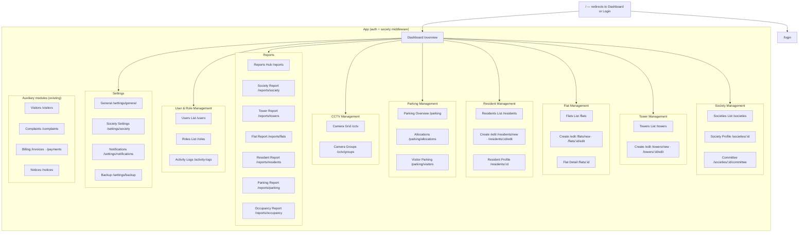
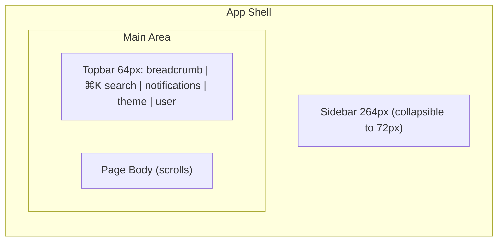

# SocioSphere — Enterprise UI/UX Design Blueprint

**Version:** 1.0
**Date:** 2026-08-06
**Scope:** Complete redesign of the SocioSphere Real Estate Management SaaS application — design system, global layout, and module-by-module UI specification.
**Audience:** Product Designers (Figma), Frontend Developers, QA, Product Managers.
**Stack context:** Laravel 12 · Inertia.js v2 · React 18 · TypeScript · Tailwind CSS v4 · Radix/Shadcn primitives · Geist (Sans + Mono) · Lucide icons · Recharts · react-hook-form + zod · next-themes (light/dark).

> **Read this first.** This blueprint is the single source of truth for the product's look, feel, and interaction behavior. Every module reuses the same primitives, spacing, and patterns defined here. If a screen needs something not covered, extend the design system first — never invent ad-hoc styles in a feature page.

---

## Table of Contents

1. [Product Overview](#1-product-overview)
2. [Information Architecture](#2-information-architecture)
3. [Navigation Structure](#3-navigation-structure)
4. [Design System](#4-design-system)
5. [Global Layout](#5-global-layout)
6. [Dashboard Design](#6-dashboard-design)
7. [Module-by-Module UI Specification](#7-module-by-module-ui-specification)
8. [Shared Components](#8-shared-components)
9. [Table Standards](#9-table-standards)
10. [Form Standards](#10-form-standards)
11. [Mobile Responsive Strategy](#11-mobile-responsive-strategy)
12. [Accessibility Guidelines](#12-accessibility-guidelines)
13. [Design Tokens](#13-design-tokens)
14. [Future Scalability](#14-future-scalability)
15. [UI Consistency Rules](#15-ui-consistency-rules)
16. [Final Recommendations](#16-final-recommendations)

---

## 1. Product Overview

### 1.1 What SocioSphere is

SocioSphere is a multi-tenant SaaS platform for residential societies and apartment complexes. Each **Society** is a tenant; within a society, towers → floors → flats form the physical hierarchy, and residents, parking, and CCTV assets attach to it. The platform replaces paper records, Excel sheets, scattered spreadsheets, and disconnected CCTV software with one unified system.

### 1.2 Design goals

| Goal | How the design delivers it |
|---|---|
| **One product, one language** | A single design system (Section 4) applied to all 10 modules with zero per-module style drift. |
| **Enterprise-grade, not admin-toolkit** | Linear/Stripe-grade polish: generous whitespace, layered surfaces, subtle shadows, tight typography. |
| **Extremely easy to use** | Every entity has one canonical page pattern (list → filters → table → detail drawer → actions). Learn one module, know them all. |
| **Fast and calm** | Skeleton loaders, optimistic UI for quick actions, predictable navigation, minimal color. |
| **Permission-aware** | Navigation, actions, and even columns react to the current user's role (Spatie RBAC). No dead buttons — actions are hidden or disabled with tooltip explanations. |
| **Accessible** | WCAG 2.2 AA contrast, full keyboard operability, focus management, reduced-motion support. |

### 1.3 User personas

| Persona | Typical role | Needs |
|---|---|---|
| **Super Admin** | Platform operator | Manage all societies, platform settings, global reports. |
| **Society Admin / Secretary** | Runs the society | Full module access for one society; committee management; reports. |
| **Committee Member** | Treasurer, maintenance in-charge | Module-scoped access (e.g., billing, complaints), read-mostly + approvals. |
| **Front Desk / Security** | Gate staff | Visitors check-in/out, CCTV live view, parking allocation lookup, quick resident search. |
| **Resident (owner/tenant)** | End user | Profile, family members, notices, complaints, invoices — a light self-service surface. |

### 1.4 Product principles

1. **Progressive disclosure** — overview first, details on demand (drawer), full context on dedicated pages.
2. **Zero dead ends** — every empty state offers a primary action.
3. **Data over decoration** — dashboards show numbers and trends, not marketing imagery.
4. **Keyboard-first power use** — command palette (`Ctrl+K`), table shortcuts, focus rings everywhere.
5. **Destructive actions are always reversible where possible** — delete requires confirmation; soft-delete with restore inside the confirmation flow.

---

## 2. Information Architecture

### 2.1 Sitemap



### 2.2 Module hierarchy and ownership

| Module | Primary entity | Owned by | Notes |
|---|---|---|---|
| Dashboard | Aggregates | All roles | Read-mostly, permission `dashboard.view` |
| Society Management | Society, Committee | Super Admin, Society Admin | Multi-society switching only for Super Admin |
| Tower Management | Tower | Society Admin, Committee | Floor count drives flat creation |
| Flat Management | Flat | Society Admin, Committee | Occupancy status transitions |
| Resident Management | Resident, Family | Society Admin, Committee, Front Desk (read) | Emergency contacts |
| Parking Management | ParkingSlot, Allocation | Society Admin, Security | Live usage map |
| CCTV Management | Camera, CameraGroup | Society Admin, Security | Read-only live grid |
| Reports | Derived data | Society Admin, Committee, Super Admin | Export-first |
| User & Role Management | User, Role | Super Admin, Society Admin | RBAC matrix |
| Settings | Config | Society Admin | Society-scoped |

### 2.3 Permission model (proposed extension of `PermissionCatalog`)

Existing prefixes: `dashboard, resident, tower, flat, user, visitor, maintenance, invoice, collection, notice, complaint, amenity, document, activity-log, role, permission`.

Proposed additions for new modules:

```
society.*      → view, create, update, delete, assign (committee)
parking.*      → view, create, update, delete, assign (allocations)
cctv.*         → view, group (manage groups)
report.*       → view, export
setting.*      → view, update
```

Permission convention stays `feature.action` (`society.update`), displayed in the Role editor via the existing `PermissionCatalog` grouping component.

---

## 3. Navigation Structure

### 3.1 Left sidebar — primary navigation

Fixed, collapsible rail. Groups (each group has a small uppercase label):

| Group | Items (Lucide icon) | Permission gate |
|---|---|---|
| **Overview** | Dashboard (`LayoutDashboard`) | `dashboard.view` |
| **Society** | Societies (`Building2`), Committee (`UsersRound`) | `society.view` |
| **Properties** | Towers (`Building`), Flats (`Layers`), Residents (`UserRound`), Parking (`SquareParking`), CCTV (`Video`) | per module `*.view` |
| **Operations** | Visitors (`DoorOpen`), Complaints (`MessageSquareWarning`), Notices (`Megaphone`), Billing (`ReceiptText`) | existing permissions |
| **Insights** | Reports (`BarChart3`) | `report.view` |
| **Administration** | Users (`UserCog`), Roles (`ShieldCheck`), Activity Logs (`History`), Settings (`Settings`) | per module `*.view` |

Behavior:
- **Active item**: filled/soft primary background pill with the accent color; left indicator dot for the active section group.
- **Badges**: notification count next to Complaints (open), Visitors (pending check-in).
- **Collapse**: to icon rail (72px) on desktop; tooltips reveal labels; state persisted.
- **Society switcher** at the top of the rail for Super Admins (combobox with search, shows society name + flat count). Non-Super Admins see their bound society name (read-only chip).
- **Footer of rail**: user mini-card (avatar, name, role) + collapse toggle.

### 3.2 Top navigation bar

- **Breadcrumbs** (left): e.g., `Properties / Towers / Tower A`. Final item is a page title (non-link). Breadcrumb on mobile collapses to a back arrow + section name.
- **Global search** (center-left, `⌘K` / `Ctrl+K`): opens the **Command Palette** — search societies, towers, flats (by number), residents, visitors, and actions (`Create resident`, `Export report`). Grouped results, keyboard navigable.
- **Notification center** (right): bell icon with unread dot → popover with tabs **All / Unread**; items link to their context (e.g., "New complaint in Flat 502 — Tower B"); "Mark all as read"; empty state illustration.
- **Theme toggle**: sun/moon segmented control (light / dark / system) — single toggle that cycles Light ↔ Dark, system default.
- **User menu**: avatar (initials, deterministic color from name hash) → dropdown: Profile, Society switcher (Super Admin), Theme, divider, Sign out.

### 3.3 Responsive navigation

- **< 1024px**: sidebar hidden; hamburger opens the sidebar as an overlay drawer (same content, scrim + escape to close).
- **< 640px**: sidebar items render as a bottom-safe overlay drawer; breadcrumbs shrink to section-level; global search collapses to a search icon that opens a full-screen command palette.

### 3.4 Keyboard navigation summary

| Key | Action |
|---|---|
| `Ctrl/⌘ + K` | Open command palette |
| `Ctrl/⌘ + /` | Show keyboard shortcuts overlay |
| `g` then `d/t/f/r/p/c` | Go to Dashboard / Towers / Flats / Residents / Parking / CCTV |
| `n` | New (context-aware: create current module entity) |
| `/` | Focus table search |
| `Shift + ?` | Keyboard shortcuts help |
| `Esc` | Close drawer/dialog/palette |

---

## 4. Design System

### 4.1 Design philosophy

**"Calm, precise, dependable."** Neutrals carry the interface; the single brand accent is used sparingly for interactive emphasis; semantic colors are reserved for state. Surfaces are flat with hairline borders (`1px`, low-contrast), and elevation is communicated with soft layered shadows rather than heavy borders. Everything is rounded but restrained (8–12px surfaces, full pill only for badges/avatars).

### 4.2 Color palette

> Tokens are semantic (light/dark aware) — see Section 13. Values below are the light-mode anchors.

**Brand — Indigo (primary accent)**

| Token | Value | Usage |
|---|---|---|
| `--brand-50` | `#eef2ff` | Selected table rows, soft active nav pill |
| `--brand-100` | `#e0e7ff` | Focus halo backgrounds |
| `--brand-500` | `#6366f1` | Focus rings, chart primary series |
| `--brand-600` | `#4f46e5` | Primary buttons, active links, links |
| `--brand-700` | `#4338ca` | Primary button hover |

**Neutrals — Zinc**

| Token | Value | Usage |
|---|---|---|
| `--bg` | `#ffffff` / dark `#0c0c0f` | App background |
| `--surface` | `#ffffff` / `#121216` | Cards, tables |
| `--surface-muted` | `#f4f4f5` / `#18181b` | Hover rows, secondary surfaces, code |
| `--border` | `#e4e4e7` / `#27272a` | Hairline borders, dividers |
| `--border-strong` | `#d4d4d8` / `#3f3f46` | Input borders (interactive) |
| `--text` | `#18181b` / `#fafafa` | Primary text |
| `--text-secondary` | `#52525b` / `#a1a1aa` | Secondary text |
| `--text-muted` | `#71717a` / `#71717a` | Placeholders, disabled, captions |

**Semantic**

| Token | Light | Dark | Usage |
|---|---|---|---|
| Success | `#16a34a` | `#4ade80` | Occupied, Paid, Approved, online CCTV, green status chips |
| Warning | `#d97706` | `#fbbf24` | Pending, Under maintenance, expiring passes |
| Destructive | `#dc2626` | `#f87171` | Delete, Vacant (careful), errors |
| Info | `#0284c7` | `#38bdf8` | New/assigned states, help text icons |

Status chips always use a **soft background + strong text** treatment (e.g., success chip = `bg-emerald-50 text-emerald-700 dark:bg-emerald-500/10 dark:text-emerald-400`), never full-saturation backgrounds.

**Chart palette (color-blind safe order):** Indigo `#6366f1`, Sky `#0ea5e9`, Emerald `#10b981`, Amber `#f59e0b`, Rose `#f43f5e`, Violet `#8b5cf6`. Dark mode: 400-level equivalents.

### 4.3 Typography

- **Font family:** Geist Sans (body/UI), Geist Mono (numbers, flat codes, IPs, logs). System fallbacks.
- **Scale:**

| Token | Size/Line | Weight | Usage |
|---|---|---|---|
| `text-xs` | 12 / 16 | 500 | Table meta, timestamps, captions, chips |
| `text-sm` | 14 / 20 | 400/500 | **Body default**, table cells, form labels, helper text |
| `text-base` | 16 / 24 | 500 | Card body emphasis, list items |
| `text-lg` | 18 / 28 | 600 | Section titles, card titles |
| `text-xl` | 20 / 30 | 600 | Page title (with breadcrumb) |
| `text-2xl` | 24 / 32 | 700 | KPI numbers, dialog titles |
| `text-3xl` | 30 / 38 | 700 | Dashboard hero numbers |
| `text-4xl` | 36 / 44 | 700 | Rare: welcome hero |
| `display` | 48–56 | 700, tight | Marketing/auth pages only |

- **Numeric alignment:** all numbers in tables/stat cards use Geist Mono and `font-variant-numeric: tabular-nums` for stable columns.
- **Headings:** `font-weight 600–700`, no letter-spacing tricks; hierarchy from size + spacing, not decoration.

### 4.4 Icon system

- **Lucide** (1.5px stroke default, 20px default size; 16px inside tables/chips; 24px in empty states).
- Icons are **decorative unless they carry meaning** — semantic icons (success/warning/error) get a matching color + `aria-hidden` + adjacent text.
- Icon buttons (`IconButton`) are 36×36px hit areas with 20px glyphs.
- Never mix icon families.

### 4.5 Border radius

| Token | Value | Usage |
|---|---|---|
| `radius-sm` | 6px | Chips, small buttons, inputs |
| `radius-md` | 8px | **Default** — buttons, inputs, selects, tabs |
| `radius-lg` | 12px | Cards, tables, dialogs, drawers, dropdowns |
| `radius-xl` | 16px | Modal dialogs, large surfaces, KPI cards (top-level) |
| `radius-full` | 999px | Badges, avatars, toggle handles, pagination dots |

### 4.6 Shadows & elevation

| Token | Light | Dark | Usage |
|---|---|---|---|
| `shadow-xs` | `0 1px 2px rgb(0 0 0 / 0.04)` | — | Hairline emphasis |
| `shadow-sm` | `0 1px 3px rgb(0 0 0 / 0.07)` | `0 1px 2px rgb(0 0 0 / 0.5)` | Cards resting state |
| `shadow-md` | `0 4px 12px rgb(0 0 0 / 0.08)` | `0 4px 12px rgb(0 0 0 / 0.45)` | Dropdowns, hover cards |
| `shadow-lg` | `0 8px 24px rgb(0 0 0 / 0.10)` | `0 8px 24px rgb(0 0 0 / 0.55)` | Dialogs, drawers |
| `shadow-focus` | `0 0 0 3px rgb(79 70 229 / 0.25)` | same | Focus rings (with border) |

Dark mode: shadows are **darker and tighter**; depth is communicated mostly through surface lightness, not shadow.

### 4.7 Grid system

- 12-column fluid grid; max content width **1440px**; gutters 24px desktop / 16px mobile; container padding 24–32px.
- Layout regions: `sidebar (264px) | content (flex 1)`; inside content: `header (64px) | page body (scroll)`.
- Dashboard and detail pages may use asymmetric grids (e.g., 2/3 + 1/3).

### 4.8 Spacing scale (4px base)

`0, 4, 8, 12, 16, 20, 24, 32, 40, 48, 64, 80, 96`.

| Semantic token | Value | Usage |
|---|---|---|
| `space-1` | 4 | Icon-to-label gaps |
| `space-2` | 8 | Chip gaps, table cell internal paddings |
| `space-3` | 12 | Input label→control gap |
| `space-4` | 16 | Card padding, form section gaps |
| `space-5` | 20 | Card→card gap in grids |
| `space-6` | 24 | Page section spacing, panel padding |
| `space-8` | 32 | Page header → content gap |
| `space-12` | 48 | Between major page sections |

### 4.9 Button variants

| Variant | Style | Usage |
|---|---|---|
| `primary` | Brand-600 bg, white text, hover brand-700 | Primary action per page (only **one** per view) |
| `secondary` | Surface + border | Secondary actions, "Apply filters" |
| `outline` | Transparent + border-strong | Additive actions (add row), file pick |
| `ghost` | Transparent, hover surface-muted | Toolbar icons, table quick actions |
| `destructive` | Rose-600 bg, white text | Delete/revoke confirmations |
| `destructive-ghost` | Transparent, rose text on hover | Row delete |
| `link` | Brand-600 underline-none | Inline navigation ("View all") |

Sizes: `sm (32px)`, `md (38px) default`, `lg (44px)`, `icon (36px)`. All include: focus ring, `active:scale-[0.98]`, disabled state (`opacity-50`, no pointer), and optional loading spinner (icon swap, `aria-busy`).

### 4.10 Form controls

- **Inputs / selects / textareas**: 38px height, `radius-md`, `border-strong`, background surface; focus = brand focus ring; prefix/suffix icon slots; clearable.
- **Combobox** (searchable select): used for towers/flats/residents/societies.
- **Switch**: for toggles (CCTV enable, notifications) — 40×24px track, 18px thumb.
- **Checkbox / radio**: brand-600 checked, square/round respectively; table header checkbox = select-all with indeterminate state.
- **Date picker**: calendar popover (native on mobile), preset ranges for reports.
- **Number inputs**: tabular numerals, step buttons, suffix units (₹/sq.ft, slots).
- **Phone inputs**: country-prefix select + number field.
- Error state: `border-destructive`, icon, message under field (red, 14px).
- All controls: 44px minimum touch target on mobile.

### 4.11 Tables, cards, badges, alerts — see Sections 8 & 9.

### 4.12 Tabs

- **Variants:** `underline` (default — 2px brand underline on active), `pills` (for filter bars), `segmented` (for view toggles: Table / Grid / Map).
- Keyboard: arrow keys cycle tabs (roving tabindex), `aria-selected` + `role="tab"`.

### 4.13 Dialogs & drawers

- **Dialog (modal):** max-width 480px (forms) / 640px (bulk/export) / 900px (confirm delete w/ related summary); overlay `bg-black/50 backdrop-blur-sm`; `Esc` + overlay click close; focus trapped; scroll-lock body.
- **Drawer (panel):** slides from right, 480px default, 720px for large forms, full-width on mobile; header (title + description + close), body scroll, sticky footer (actions) — sticky footer is mandatory for form drawers.
- Both animate in 150–200ms with `prefers-reduced-motion` respected.

### 4.14 Toast notifications

- Fixed top-right stack (bottom-center on mobile), width 360px.
- Variants: success (emerald check), error (rose), warning (amber), info (brand/sky). Auto-dismiss 4s (success/info), 8s (warning); errors persist until dismissed.
- Each toast: icon, title, optional message, close button; action button variant for undo ("Undo delete", "View complaint").
- 1 toast per intent; stacked with animation; `role="status"` / `role="alert"`.

### 4.15 Empty states

Standard pattern: 96px area with 48px icon in a soft circle, title (`text-base` 600), description (`text-sm` secondary, max-width 320px centered), primary action button + optional secondary ("Import CSV"). Variants: `no-results` (filter icon + "Clear filters" action), `no-data` (module icon + "Create first X" action), `search-empty` (search icon + "Try different keywords").

### 4.16 Loading & skeleton states

- **Initial page load**: skeleton blocks mimicking final layout (KPI rows, table rows 6×, sidebar skeleton on first paint).
- **In-page queries**: keep old data + subtle opacity `60%` with a slim top progress bar (Inertia start/end events).
- **Skeleton rules**: shimmer via gradient sweep (1500ms, disabled under reduced motion), never spinner for layout-level loads; spinner only inside buttons/small areas.

### 4.17 Error states

- **403**: full-page state — lock icon, "You don't have access to this module", role hint, "Request access" (mailto/contact) + "Back to dashboard".
- **404**: full-page — "Page not found", link to dashboard + search suggestion.
- **500**: full-page — "Something went wrong", auto issue ID, "Try again" + "Contact support".
- **Inline errors**: field-level (red border + message), form-level banner (Alert top of form), server-side flash (`danger` alert at top of page body).

---

## 5. Global Layout

### 5.1 Desktop anatomy (≥1024px)



- Sidebar is fixed; main area scrolls independently. Sidebar background = app background with a right hairline border (not a colored panel).
- **Page body** structure (every page):

```
PageHeader (48–56px)
  ├─ Title (xl, 600) + optional subtitle (sm, secondary)
  ├─ Right actions: [secondary] [primary]
  ├─ Optional: description/context line
PageToolbar (optional): filter bar + view toggles + search (only for list pages)
Content: grid of cards / table
```

### 5.2 The three canonical page layouts

1. **List page** — `PageHeader` → `FilterBar` → `DataTable` card (or grid/cards view toggle) → pagination. Used by Towers, Flats, Residents, Users, Visitors, Complaints, Invoices, Notices.
2. **Detail page** — `PageHeader` (with back link + action menu) → summary card row → tabs (`Overview / Relations / Activity`). Used by Society Profile, Resident Profile, Flat Detail.
3. **Workbench page** — custom grid, dashboard-like. Used by Dashboard, Parking Overview, CCTV Grid, Reports Hub.

### 5.3 Logged-out layouts

- **Login / Forgot password**: centered card (440px) on a subtle gradient background with the logo; right-side split panel on ≥1280px with a rotating brand visual (occupancy stat graphic); footer links (privacy, terms, help). No sidebar/topbar.
- OTP step keeps the same card with stepper indicator (Email → OTP → Done).

---

## 6. Dashboard Design

**Route:** `/overview` · **Permission:** `dashboard.view`

### 6.1 Purpose

Executive summary of the society's operational health: occupancy, property inventory, residents, parking, CCTV status, and recent activity — actionable in under 10 seconds.

### 6.2 Layout (desktop: 12-col grid)

**Row 1 — KPI cards (4 × 1/4):**
Each KPI card: icon (soft-tinted 40px square), label (sm, secondary), value (2xl/3xl, bold, tabular), delta chip (vs last month: green ↑ / red ↓ / neutral –), and micro sparkline (16px height, optional).

| KPI | Icon | Value | Delta source |
|---|---|---|---|
| Total Towers | Building2 | count | vs last month |
| Total Flats | Layers | count | vs last month |
| Occupied Flats | Home | count + % occupancy | occupancy trend |
| Vacant Flats | DoorOpen | count | vacancy trend |

Clicking a KPI navigates to the filtered list (e.g., Vacant Flats → `/flats?status=vacant`).

**Row 2 (2/3 + 1/3):**
- **Occupancy Overview** (bar/area chart): flats by status per tower — stacked bars (Occupied / Rented / Vacant), 12-month area sparkline toggle. Legend chips with counts; hover tooltip shows breakdown per tower.
- **Parking Usage** (donut): allocated vs free per type (4W / 2W / Visitor), center total, legend with counts.

**Row 3 (1/3 + 1/3 + 1/3):**
- **Tower Distribution** (horizontal bars): flats & occupancy per tower.
- **Resident Growth** (line): residents added per month, last 12 months.
- **CCTV Status** (status list): cameras online/offline count, top card = "6/8 cameras online" with per-group mini progress.

**Row 4 (2/3 + 1/3):**
- **Latest Activities** (feed): avatar + action text + timestamp, from `ActivityLog` (`John updated Flat 502`, `System auto-allocated parking P-014`). Link "View all →" to `/activity-logs`.
- **Alerts + Quick actions** (right column, stacked):
  - **Alerts card**: unresolved complaints count, pending visitor passes, expiring visitor passes, overdue maintenance → each clickable to filtered list. Amber/rose tinted icons.
  - **Quick actions**: grid of 2×2 icon buttons — Add Resident, Register Tower, Allocate Parking, New Notice.

**Row 5 (1/3 + 2/3) — optional:**
- **System health** (Super Admin only): queue status, backup age, storage usage, last job run.
- **Recent residents** (mini table): avatar, name, flat, joined date, status chip.

### 6.3 Interactions

- All charts: hover = crosshair + tooltip card, click legend to toggle series; export chart as PNG via card menu.
- KPI cards: entire card clickable; `Enter` works.
- Range switcher (top-right of dashboard): **7D / 30D / 90D / YTD** — controls all time-series charts together; persisted per user.
- Empty states: no data → chart skeletons then single-card empty state with "Add your first tower" primary.

---

## 7. Module-by-Module UI Specification

> Each module follows the **canonical pattern**: list → filter → table → drawer detail → forms (drawer or page) → delete confirm → bulk → export. Differences are called out; sameness is assumed.

### 7.1 Society Management

**Purpose:** Register and manage multiple societies (platform-level), each society's profile and governing committee.

**Navigation:** Sidebar → *Society* → Societies / Committee.

**Pages:**

#### 7.1.1 Societies list (`/societies`)
- **PageHeader:** "Societies" + subtitle "Manage societies on your platform" · actions: [Export CSV] [Register Society ▾] (primary).
- **Stats row (Super Admin only):** Total Societies · Active · Trials/Expiring · Total Flats across societies.
- **FilterBar:** Search (name, city, Pincode), Status select (Active / Suspended / Trial), Plan select, sort by (Name / Created / Flats).
- **DataTable columns:** Society (logo avatar + name + city) · Plan chip · Flats (count) · Towers (count) · Residents (count) · Status chip · Created · Actions (⋯): View profile, Manage committee, Suspend/Activate, Delete.
- **Detail drawer** (row click): profile summary + key stats + recent activity.

#### 7.1.2 Society profile (`/societies/:id`)
- **Header:** back link, society logo + name + status chip, action menu (Edit, Suspend, Delete).
- **Tabs:**
  - *Overview*: description card, contact card (address, email, phone), stats grid (towers/flats/residents/occupancy %).
  - *Committee*: members grid (avatar, name, role chip — President/Secretary/Treasurer/Member, term dates, active toggle) + [Add member] (drawer: search user → role → term).
  - *Activity*: scoped `ActivityLog` feed.

#### 7.1.3 Create/Edit society (drawer, 720px, or page)
Sections: **Basic** (Name*, Logo upload, Plan select, Status select) · **Contact** (Address line 1/2, City*, State, Pincode*, Phone, Email*) · **Administration** (Admin user: create-or-link, email, password for new).
Validation: required marked `*`, pincode format (6 digits), email format; server errors mapped to fields; duplicate-name warning before submit.

**Delete flow:** Confirm dialog (type `"DELETE"` to enable button — for societies only) listing cascading impact (X towers, Y flats, Z residents will be affected). Soft-delete + restore in drawer.

**Permissions:** `society.view/create/update/delete/assign`. Non-Super Admins see only their bound society (read-only).

**Empty state:** "No societies yet" → "Register your first society".

**Bulk actions:** none for societies (platform list) except multi-suspend on Super Admin.

---

### 7.2 Tower Management

**Purpose:** Register towers, configure floors, and enable flat numbering.

**Navigation:** Sidebar → *Properties* → Towers.

**List (`/towers`):**
- **Stats row:** Total Towers · Total Flats · Avg occupancy / tower · Under maintenance count.
- **FilterBar:** Search (name/code), Status (Active / Under maintenance / Inactive), Min/max floors.
- **DataTable:** Tower (name + code chip) · Floors · Flats count · Occupied % (progress bar, 120px) · Status chip · Created · Actions (⋯): View, Edit, Flats, Maintenance toggle, Delete.
- **Card grid toggle**: tower cards with mini occupancy donut (nice for small counts).

**Detail drawer:** tower summary, floor breakdown (floors with flat counts), maintenance history mini-feed, "View flats" link.

**Create/Edit form (drawer, 720px):**
- **Section: Identity** — Name*, Code* (auto-suggested from name, editable, e.g., `TWR-A`), Status, Description.
- **Section: Configuration** — Number of floors* (8–60), flats per floor* (2–12), **Flat numbering pattern***: `PREFIX + FLOOR + NUMBER` with live preview (`A-502`), start numbers, skip floor 4 toggle (common convention), numbering direction (left→right / right→left).
- On save: system **bulk-generates flats** with sequential codes; progress toast "Generating 48 flats… done".

**Delete:** confirm dialog with impact summary; if flats exist, require either "Delete flats too" or reassign (prevent deleting towers with residents).

**Permissions:** `tower.view/create/update/delete`. Committee: view + update (maintenance) by config.

**Bulk actions:** select multiple → Suspend / Activate / Delete (with confirm).

**Export:** CSV (columns mirror table), Excel option via dropdown.

**Empty state:** "No towers yet" → "Create your first tower" (steps hint: Name → Floors → Numbering).

**Validation:** code unique within society; floors 1–100; pattern preview updates live; duplicate pattern warning.

---

### 7.3 Flat Management

**Purpose:** Track every flat's ownership, occupancy, and tenant details; single source of truth for the physical property grid.

**Navigation:** Sidebar → *Properties* → Flats.

**List (`/flats`):**
- **Stats row:** Total Flats · Occupied · Rented · Vacant · Occupancy %.
- **FilterBar:** Search (flat code, resident name), **Tower select** (multi), **Floor select**, **Status segmented** (All / Occupied / Rented / Vacant / Under maintenance), Owner vs Tenant filter, sorting.
- **DataTable:** Flat code (mono, bold) · Tower · Floor · Owner (avatar + name, or "—") · Occupant (avatar + name + tenant chip) · Status chip · Last updated · Actions (⋯): View, Edit, Assign resident, Mark vacant, Delete.

**Detail drawer:** flat summary header (code, tower/floor breadcrumb, status chip) · tabs or sections: **Ownership** (owner name/contact/since), **Occupancy** (current occupant, move-in date, type), **Parking** (allocated slots), **Bills** (last invoice, payment status).

**Create/Edit form (drawer, 720px):**
- **Section: Location** — Tower* (combobox), Floor* (select, derived from tower floors), Flat number* (auto-suggested from pattern), Code (read-only preview).
- **Section: Ownership** — Owner type (Owner/Tenant), Owner resident (combobox with search + "Create new"), Move-in date, Monthly maintenance, Notes.
- Changing tower re-derives floor options; changing floor re-suggests number.

**Status transitions:** quick action menu on rows — Mark occupied / Mark vacant / Start maintenance (each opens small confirm drawer with optional date + note).

**Bulk actions:** Assign status, Assign tower (re-home), Export, Delete (confirm + impact).

**Permissions:** `flat.view/create/update/delete`.

**Empty state:** tower exists but no flats → "Generate flats from Tower settings" (deep link to tower edit); no towers → "Create a tower first".

---

### 7.4 Resident Management

**Purpose:** Resident profiles with family, contacts, emergency contacts; owner/tenant records.

**Navigation:** Sidebar → *Properties* → Residents.

**List (`/residents`):**
- **Stats row:** Total residents · Owners · Tenants · Families · Emergency contacts on file.
- **FilterBar:** Search (name, phone, email, flat), Type segmented (All / Owner / Tenant), Flat filter, Tower filter, Status (Active / Inactive), sort.
- **DataTable:** Resident (avatar + name + type chip) · Flat · Contact (phone, mono) · Email · Family (count) · Status · Joined · Actions (⋯): View, Edit, Add family member, Deactivate.
- **Grid toggle** (people cards with avatars) for small societies.

**Detail page (`/residents/:id`)** — the richest page in the app:
- **Header:** avatar (96px), name, type chip + status chip, flat link, action menu (Edit, Deactivate, Delete, Message).
- **Tabs:**
  - *Overview*: personal card (DOB, gender, occupation, blood group), contact card (phone, email, alternate), flat card (owned/rented, move-in).
  - *Family*: member cards (avatar, relation chip, DOB, phone, emergency toggle) + [Add member] (drawer).
  - *Emergency*: table of emergency contacts (name, relation, phone, priority star) + [Add].
  - *Activity*: scoped log feed.

**Create/Edit form (drawer 720px or full page):**
- **Section: Personal** — Full name*, Photo, DOB, Gender, Blood group, Occupation, Marital status.
- **Section: Contact** — Phone* (with country code), Email, Alternate phone.
- **Section: Residence** — Type* (Owner/Tenant), Tower + Flat (combobox pair), Move-in date, Owner linked resident (for tenants).
- **Section: Emergency** — up to 3 emergency contacts (name, relation, phone, is-primary) with add/remove rows.
- **Section: Family** — optional family member rows (name, relation, DOB, phone).
- Social: aadhaar/ID fields optional, masked on display.

**Delete flow:** standard confirm; if resident has family members → warning "X family members will be removed"; if owns flat → block with explanation (unassign first). Soft-delete.

**Permissions:** `resident.view/create/update/delete`. Front Desk: view only.

**Export:** CSV/Excel with sensitive-column toggle (mask phones/emails option).

**Empty state:** "No residents yet" → "Add your first resident" + secondary "Import from CSV".

---

### 7.5 Parking Management

**Purpose:** Allocate and monitor parking — 4-wheelers, 2-wheelers, visitor parking.

**Navigation:** Sidebar → *Properties* → Parking.

**Pages (tabbed workbench, `/parking`):**

- **Stats row:** Total slots · 4W allocated/free · 2W allocated/free · Visitor slots free now · Utilization %.
- **Tabs:** Overview (map) / Allocations (table) / Visitor (table).

#### 7.5.1 Overview — slot map
- Filter bar: Type segmented (All / 4W / 2W / Visitor), Tower/Block select, search slot code.
- **Slot grid** (visual map): cards arranged by zone (e.g., `P-B1`) — each slot card: code, status color fill:
  - Free (surface + dashed border), Allocated (brand tint), Visitor-occupied (amber tint), Maintenance (neutral striped), Reserved (violet tint).
- Click slot → mini drawer: slot info, current allocation (resident, flat, vehicle no. `mono`), history, actions: Allocate / Release / Mark maintenance.
- Legend bottom-left; "All slots available" state shows all-free.

#### 7.5.2 Allocations table
- Columns: Slot code · Type chip (4W/2W) · Zone · Allocated to (resident avatar + name) · Flat · Vehicle no. (mono) · Valid from · Status · Actions (⋯): Edit, Release (confirm), History.
- **Bulk:** Select slots → **Auto-assign** wizard (choose residents/flats, algorithm assigns nearest free slot) or Release.

#### 7.5.3 Visitor parking
- Columns: Slot · Visitor name · Vehicle no. · From → To · Purpose · Approved by · Status (Booked / Checked-in / Expired) · Actions: Check-in, Check-out, Release.
- Linked to Visitor Pass module (existing) — creating a visitor pass with "parking required" auto-reserves a slot.

**Create allocation form (drawer):** Slot* (combobox of free slots), Resident* (combobox), Vehicle no.*, Vehicle type auto from slot, Valid from/to dates, Notes.

**Permissions:** `parking.view/create/update/delete/assign`.

**Empty state:** no slots configured → "Set up parking zones first" wizard (zones → slot counts per type → generate).

**Export:** allocations CSV; daily utilization report.

---

### 7.6 CCTV Management

**Purpose:** Live camera feeds, groups, and secure access.

**Navigation:** Sidebar → *Properties* → CCTV.

**Pages:**

#### 7.6.1 Camera grid (`/cctv`)
- **Toolbar:** Group tabs (pills: All / Lobby / Lifts / Parking / Perimeter / Children's area), Layout segmented (1×1 / 2×2 / 3×3), Fullscreen toggle, Refresh, "Add camera".
- **Camera card (aspect 16:9):** video area (dark `#0a0a0c`), overlay top-left: camera name + group chip; top-right: **LIVE** chip (emerald pulse when streaming, gray `OFFLINE` when not); bottom: timestamp (mono) + controls (Fullscreen, Snapshot, Mute).
- Click card → **focus view** (2×2 grid center, others as thumbnails) — security guard default.
- Offline card: dark surface, center broken-video icon, "Reconnecting…" state, last-seen.
- **Security:** playback/snapshot actions gated by `cctv.group` permission; all CCTV pages require re-auth token if > 15 min idle (setting); screenshots watermarked (society + timestamp).
- **Empty state:** "No cameras added" → "Add your first camera" (IP/RTSP URL, name, group, location).

#### 7.6.2 Camera groups (`/cctv/groups`)
- Card list of groups: name, camera count, thumbnail strip (3 tiles), actions (Edit, Add camera).
- Create/edit: name*, description, location (tower/floor), camera multi-select.

**Create/edit camera (drawer):** Name*, Group* (combobox), Stream URL* (RTSP/HLS), Location (tower/floor select), Orientation, Enabled switch, Thumbnail preview when URL valid.

**Permissions:** `cctv.view`, `cctv.group`. Security role default: view only.

**Delete:** confirm dialog (permanent — streams removed); warn if in group.

---

### 7.7 Reports

**Purpose:** Printable/exportable operational reports per domain.

**Navigation:** Sidebar → *Insights* → Reports.

**Reports Hub (`/reports`):**
- **PageHeader:** "Reports" · [Schedule report ▾] (Pro).
- **Report cards grid (2-col):** Society · Tower · Flat · Resident · Parking · Occupancy. Each card: icon, title, description, "last generated" meta, thumbnail-style mini-chart, [Generate] button.

**Shared report generator (drawer or page):**
1. **Configure** — Report type (preselected), date range presets (This month / Last month / Quarter / Custom), Scope filters (tower/flat/status for flat report; zones for parking), Group by (tower/floor/status/type), Include sections (checkboxes: summary, tables, charts, notes).
2. **Preview** — live preview pane (mini version) + "Full preview".
3. **Export** — format segmented (PDF / CSV / Excel), orientation (portrait/landscape), branding toggle (society logo + header).

**Report output spec (all types):**
- Cover header: society logo, report title, date range, generated timestamp, generated by.
- **Summary block:** KPI chips row (counts + totals).
- **Tables:** consistent with app tables (mono numbers).
- **Charts:** bar (occupancy by tower), line (growth), donut (distribution).
- Footer: pagination, "Generated by SocioSphere" + timestamp.

**Per-type definitions:**

| Report | Core table | Charts | Summary KPIs |
|---|---|---|---|
| Society | societies + status | societies by plan | total societies, flats, residents, occupancy |
| Tower | tower rows + floors/flats/occupancy | occupancy per tower | towers, avg occupancy, maintenance |
| Flat | flats + owner/occupant/status | status distribution | total, occupied, vacant, rented |
| Resident | residents + type/flat/contacts | owner vs tenant, growth | residents, families, owners, tenants |
| Parking | slots + allocation status | utilization by zone/type | total slots, allocated, free, visitor |
| Occupancy | occupancy by tower/floor | trend (12m), status donut | %, occupied, vacant, trend |

**Permissions:** `report.view`, `report.export`.

**Empty state:** no data for range → "No data for selected period" + widen-range action.

---

### 7.8 User & Role Management

**Purpose:** Users, roles with permission matrices, and activity audit.

**Navigation:** Sidebar → *Administration* → Users / Roles / Activity Logs.

#### 7.8.1 Users (`/users`)
- **Stats row:** Total users · Active · Invited · Suspended.
- **FilterBar:** Search (name/email), Role select, Status segmented, Society select (Super Admin).
- **DataTable:** User (avatar + name + email) · Role chips (multi) · Society (Super Admin) · Status chip · Last active · 2FA chip · Created · Actions (⋯): Edit, Impersonate (Super Admin, with clear banner), Suspend/Activate, Delete.
- **Detail drawer:** user summary + role assignment + last login + permissions preview.
- **Create/Edit form (drawer, 640px):** Name*, Email*, Phone, Role multi-select (checkbox list grouped by module), Society (Super Admin), Status, Send invite toggle. Invite flow: creates user + email invite link (no password set).
- **Delete:** confirm; if user owns data (e.g., created invoices), prompt to reassign ownership or archive.

**Permissions:** `user.view/create/update/delete`.

#### 7.8.2 Roles (`/roles`)
- **Cards or table:** role name, description, user count, built-in chip (non-editable), actions (Edit permissions, Duplicate, Delete).
- **Editor (drawer, 900px):** role name/description header; **permission matrix** — feature groups (from `PermissionCatalog`): each group row = label + action checkboxes (View/Create/Update/Delete/Assign) + group "select all" checkbox; sticky header with select-all column; search within permissions; "Select all for group" hover affordance; unsaved-changes guard.
- Built-in roles (Super Admin, Society Admin, Committee Member, Front Desk, Resident) locked from deletion; editable permissions warned ("Changing built-in roles may reduce security").

**Permissions:** `role.view/create/update/delete`, `permission.*` implied.

#### 7.8.3 Activity logs (`/activity-logs`)
- **FilterBar:** Search (description, actor), Actor select, Module select (from catalog), Action select (created/updated/deleted), Date range, Society (Super Admin).
- **DataTable (read-only, no row actions):** Timestamp · Actor (avatar + name) · Action chip · Module chip · Description (e.g., "Updated Flat 502") · Society · IP (Super Admin, mono).
- **Export** CSV/Excel; **drill-down drawer** with old/new value diff (JSON pretty, mono, diff-highlighted).
- No create/edit/delete; pagination + "live" refresh toggle.

---

### 7.9 Settings

**Purpose:** Society and platform configuration.

**Navigation:** Sidebar → *Administration* → Settings (opens `/settings/general`).

**Layout:** left sub-nav (tabs as vertical list, 200px) + content panel. Sections:

#### 7.9.1 General
- Society name, logo upload, tagline, timezone select, date format select, currency select (₹/USD), language select (future).
- Save bar pattern: inline card with [Save changes] enabled only on dirty state; "Saved" checkmark flash.

#### 7.9.2 Society (defaults)
- Default tower/flat numbering pattern; default maintenance amount; parking rules (max 4W per flat, visitor slots count); CCTV retention (days, 7/14/30); flat status defaults (new flats vacant).

#### 7.9.3 Notifications
- Toggle matrix: channel (In-app / Email / SMS) × event (New complaint, New visitor pass, Payment received, Pass expiring, Camera offline, Backup completed). Master switch per row/column.
- Test send buttons.

#### 7.9.4 Security & Backup
- Session timeout minutes, password policy (length, complexity), 2FA enforcement toggle (per role), IP allowlist (Super Admin).
- **Backup card:** last backup time, schedule select (daily/weekly), retention, storage used (progress bar), [Backup now] (progress state), restore guide (read-only instructions, no in-app restore — out-of-band for safety).

**Permissions:** `setting.view/update`; Super Admin sees platform-level settings when no society bound.

**Validation:** standard field-level; unsaved-changes guard per section (banner "You have unsaved changes" + discard/keep).

---

### 7.10 Auxiliary modules (existing codebase — design alignment only)

Visitors (check-in/out lifecycle), Complaints (ticket + timeline), Billing (invoices/payments/collection), Notices. These reuse the exact same patterns: list + filter + table + drawer + status chips (Approved/Rejected, Open/In-progress/Resolved, Paid/Partially paid/Overdue, Published/Draft). They are covered by Sections 8–10; no bespoke styles.

---

## 8. Shared Components

| Component | Spec summary |
|---|---|
| **PageHeader** | Title + optional subtitle + action slot; consistent 32px bottom margin; no borders (whitespace separates). |
| **CommandPalette** | `⌘K`; search input (icon, clear, hint chip); grouped results (People / Properties / Actions / Reports); footer hint row with shortcuts; empty state "No results". |
| **FilterBar** | Single row (wraps on mobile) of: search input (min 220px) + filter selects + [Reset] ghost + [Apply] secondary when auto-apply off; active-filter chips row below (removable); `Enter` applies. |
| **DataTable** | See Section 9. |
| **StatCard / KPI** | Icon tile + label + value + delta chip + optional sparkline; 16px padding; `radius-lg`; hover shadow-sm. |
| **Avatar** | Initials with deterministic pastel background from name hash; sizes 20/24/32/40/64/96; status dot (online/offline) for users; group avatar stack (max 3 + count). |
| **Badge/Chip** | `radius-full`, sm (16px) / md (20px); variants: neutral, brand, success, warning, destructive, info, outline; optional dot + icon. |
| **Alert** | 4 variants (info/success/warning/destructive), icon + title + optional description + action slot; `role="alert"`; destructive auto-focuses confirm buttons. |
| **ConfirmDialog** | Title, description, optional impact list (danger styling), optional typed-confirmation input (for societies), [Cancel] [Destructive confirm]; `aria-describedby`. |
| **EmptyState** | Standard block (see 4.15); used by tables, dashboards, drawers. |
| **Skeleton** | Base block with shimmer; variants: text, avatar, button, table-row, card, chart. |
| **ProgressBar** | Linear 4px top bar (Inertia events), + inline progress (occupancy, storage) with mono percentage. |
| **Tabs / SegmentedControl / Pills** | Underline tabs for detail pages; segmented for view toggles; pills for filter groups. |
| **Tooltip** | Hover/focus-triggered, 12px above target, arrow, max 240px, dark surface; used for icon-only actions & truncated text. |
| **Popover/DropdownMenu** | For row actions, user menu, notifications; `radius-lg`, shadow-md, min 180px, keyboard navigable, closes on outside click/Esc. |
| **Drawer & Dialog** | See 4.13. |
| **Toast** | See 4.14. |
| **Sheet (mobile nav)** | Sidebar content in overlay; full-height; scrim; focus trap. |
| **Breadcrumb** | Auto from route tree (Ziggy); last item bold non-link; `aria-label="Breadcrumb"`; mobile collapses. |
| **DateRangePicker** | Dual calendar + preset chips; returns ISO range; used in reports & logs. |
| **ChartCard** | Card wrapper for all charts: title, subtitle, right slot (range/legend/menu), chart area with fixed heights (160–260px), skeleton state, empty state, PNG export. |
| **InlineEdit** (advanced) | Editable text on hover pencil (for notes/descriptions in detail pages); optimistic with rollback toast. |

---

## 9. Table Standards

**The enterprise table** — used identically in every list module.

### 9.1 Anatomy (top → bottom)

```
┌─ Table card (radius-lg, border, surface) ──────────────────────┐
│ Toolbar: [bulk bar OR table title + count] [view toggle] [⋯]   │
│ Column header row (sticky, surface-muted, 40px, uppercase xs)  │
│  ▢ checkbox · column headers (sort arrows) · ⋯ actions         │
│ Body rows (48px, zebra off, hover surface-muted, selected tint)│
│  ▢ checkbox · cells · status chip · quick actions (icons)      │
│ Footer: rows-per-page (10/25/50/100) · count "1–25 of 1,204"   │
│  · pagination (‹ 1 2 3 … 51 ›) · jump-to-page                  │
└────────────────────────────────────────────────────────────────┘
```

### 9.2 Required behaviors

| Feature | Spec |
|---|---|
| **Sticky header** | Column header sticks within its scroll container (max-height 70vh scroll for tall tables). |
| **Sorting** | Clickable headers; single-sort with direction toggle; active column = brand text + arrow; `aria-sort`; server-side. |
| **Column visibility** | "Columns" menu (dropdown, checkbox list, drag reorder); persisted per module per user. |
| **Search** | Toolbar search input (debounced 300ms) scoped to the table; combined with FilterBar search if present (FilterBar wins for structured filters). |
| **Server-side pagination** | Offset/cursor; `usePagination` hook exists; URL-synced (`?page=2&sort=name&dir=asc`); back/forward preserved. |
| **Bulk selection** | Header checkbox = select-all-page with indeterminate; selected count bar replaces toolbar ("3 selected · [Assign status] [Export] [Delete]"); selection persists across pages via checkbox list memory; clear on navigation. |
| **Filters** | Via FilterBar (Section 8); every filter reflected in URL; "Reset" restores defaults. |
| **Status chips** | Standard chip variants; never raw text for statuses. |
| **Quick actions** | Hover-revealed icon buttons (ghost) at row end: View, Edit, ⋯ (more) — 3 max; destructive always behind the ⋯ menu. |
| **Row click** | Opens detail drawer (except when clicking interactive cells); `Enter` on row focus. |
| **Export** | Toolbar menu: CSV / Excel / PDF (report modules); exports respect current filters + sorting; progress toast; async job + notification for > 5k rows. |
| **Responsive** | < 768px: hide low-priority columns via breakpoint metadata per column; < 480px: convert to card list (first cell = title, rest = definition rows) with "View" affordance; horizontal scroll as fallback with scroll hint. |
| **Empty/loading/error** | EmptyState slot; 6 skeleton rows on load; inline error banner with Retry. |
| **Zebra striping** | Off (modern); alternate via subtle `surface-muted/40` only in printable reports. |

### 9.3 Cell conventions

- Text left-aligned; numbers right-aligned (mono, tabular); dates `d MMM yyyy` (`2 Aug 2026`) with relative tooltip.
- Avatar columns: avatar + name stacked (name 500, meta 12px secondary).
- Truncation: max 1 line, ellipsis + tooltip for primary identifiers.
- Empty cell: `—` (secondary).

---

## 10. Form Standards

### 10.1 Anatomy

```
FormPanel (card, max-width 960px center, radius-lg)
 ├─ Section header: number or icon + title (lg, 600) + description (sm, secondary)
 ├─ Field grid: 2-col desktop (1-col mobile), 16px gaps
 │   Field: Label* (sm, 500, htmlFor) → Control → Helper (sm, secondary)
 │                                   → Error (sm, destructive, icon)
 ├─ Dynamic rows (emergency contacts, family members, invoice items):
 │   row = controls + remove icon; "Add row" outline button
 └─ Footer actions (sticky in drawers): [Cancel] [Reset(ghost)] [Save primary]
     · Save states: idle → saving (spinner in button) → success toast → close drawer / redirect
```

### 10.2 Rules

| Rule | Detail |
|---|---|
| **Section headers** | Every form has 1–4 sections max; section number optional; never nest sections deeper than 2. |
| **Logical grouping** | Identity → Configuration → Relations → Notes; sections match entity semantics (see module specs). |
| **Validation** | Client (zod + RHF, on blur + submit) first, server (FormRequest) second; server errors map to fields or form-level banner. Validate on blur for single fields, on submit for complex. |
| **Inline help** | Helper text only when genuinely useful (e.g., numbering pattern preview); avoid generic "Enter your name". |
| **Error messages** | Under the field: `<icon> Message`; label turns destructive; never block with alert dialog for field errors. |
| **Responsive** | Fields collapse to single column < 640px; grids reflow; drawers become full-screen sheets on mobile. |
| **Save Draft** | Where entities are long (society, resident): [Save draft] ghost button persists partial data without validation, shows "Draft saved" toast, keeps form open. |
| **Cancel** | Close without saving; if dirty → unsaved-changes dialog (Discard / Keep editing). |
| **Reset** | Restores last-saved values (not empty); only in edit mode; disabled if untouched. |
| **Dirty tracking** | Footer primary disabled until dirty or touched; "Unsaved changes" indicator dot near title. |
| **Required markers** | `*` on label + `aria-required`; legend note "Fields marked * are required" only when forms exceed one section. |
| **Autofocus** | First meaningful field on open (not selects/checkboxes); `autofocus` dialog focus ring. |
| **Submit** | `Enter` submits within dialogs/panels; buttons `type="submit"`; prevent double submit (busy state). |

### 10.3 Wizard (complex creation — parking zones, society onboarding)

Stepper (1 Identity · 2 Configuration · 3 Review) with: numbered steps, back/continue, section validity gating, review summary before final submit. Used only when > 2 dependent sections.

---

## 11. Mobile Responsive Strategy

| Breakpoint | Behavior |
|---|---|
| **≥1280px (xl)** | Full grid: 12-col, sidebar 264px expanded, max content 1440px. |
| **1024–1279px (lg)** | Sidebar auto-collapses to 72px rail; content full width. |
| **768–1023px (md)** | Sidebar off-canvas (hamburger); grids collapse 2-col → 1-col for KPI (2×2 still); tables: hide low-priority columns; toolbars wrap. |
| **<768px (sm)** | KPI 2×2 grid; tables → card list mode; drawers full-screen; dialogs full-screen (bottom-sheet style); pagination → "Load more" or prev/next only; charts stack vertically; toast bottom-center; filter bar becomes expandable "Filters" button (badge = active count) opening a sheet. |
| **<480px (xs)** | Touch targets 44px min; page padding 16px; quick-action icons condense to primary action + ⋯; sticky bottom action bar for forms. |

Mobile nav: drawer with grouped items (collapsible groups), active states, society chip pinned top.

---

## 12. Accessibility Guidelines

- **Targets:** WCAG 2.2 **AA**; contrast ≥ 4.5:1 text, ≥ 3:1 UI components/graphics; status chips use text + icon (not color alone).
- **Focus:** visible focus ring (2px brand + 3px halo) on every interactive element; logical tab order; skip-to-content link; `prefers-reduced-motion` disables shimmer, slide, and pulse animations.
- **Keyboard:** full operability — tables (row focus + Enter opens drawer), dialogs (focus trap + restore), comboboxes (type-ahead), menus (arrow keys), tabs (roving tabindex). `Esc` closes overlays.
- **ARIA:** landmarks (`<main>`, `<nav aria-label="Primary">`), `role="dialog"` + labelledby, `role="alert"` for toasts/errors, `aria-live="polite"` for inline updates, `aria-expanded` on toggles, `aria-sort` on headers.
- **Semantics:** real `<table>` for tabular data; `<button>`/`<a>` correctness; form labels via `htmlFor`; icons `aria-hidden` when decorative; error summaries connected via `aria-describedby`.
- **Screen readers:** consistent heading order (h1 page → h2 sections), drawer/dialog announces title on open, toast messages announced without stealing focus.
- **Testing:** automated (axe) in CI + quarterly manual passes with keyboard-only and NVDA/VoiceOver.

---

## 13. Design Tokens

Structured as CSS custom properties on `:root` and `.dark` (Tailwind v4 `@theme` mapping). Categories:

```
color.bg / color.surface / color.surface-muted / color.border / color.border-strong
color.text / color.text-secondary / color.text-muted
color.brand.{50..700} / color.success / color.warning / color.destructive / color.info
color.chart.{1..6}
font.family.sans / font.family.mono
font.size.{xs..display} + line-heights
radius.{sm,md,lg,xl,full}
shadow.{xs,sm,md,lg,focus}
space.{1..12}
duration.{fast:150ms, base:200ms, slow:300ms}
easing.{standard, emphasized, exit}
z-index: dropdown 30 · sticky 40 · overlay 50 · modal 60 · toast 70
```

Every component consumes **only tokens** — no raw hex/px in feature code. Theme toggle flips the `.dark` class (next-themes); tokens are the only theme surface.

---

## 14. Future Scalability

| Area | Plan |
|---|---|
| **Design system as package** | Extract `@sociosphere/ui` (Shadcn registry + tokens) so future apps (resident portal, mobile) share it. |
| **Resident self-service portal** | Reuse the design system; role-driven route group; same components, narrower module set (profile, notices, complaints, invoices). |
| **Multi-language** | All copy via i18n keys from day one; text-length-safe layouts (no fixed widths on labels). |
| **Theming/branding per society** | Token overrides per society (logo + accent derived from brand color) — enabled by token-first architecture. |
| **Dark/light/high-contrast** | Token-driven; high-contrast variant via overrides. |
| **Embeddable widgets** | CCTV focus view, parking map, occupancy chart as iframe/widget embeds (Kiosk mode for lobbies). |
| **Billing & maintenance modules** | Onboard with the same table/form standards; chart palette extended, not replaced. |
| **Webhook/API consumers** | Design system is visual only — data contracts stay server-side; UI pattern for API keys in Settings. |
| **Analytics** | Dashboard becomes composable: add widgets via ChartCard registry without new styles. |

---

## 15. UI Consistency Rules

**Do**
- Use the 4px spacing scale exclusively; never ad-hoc margins.
- Use PageHeader on every page; one primary button per view.
- Use the canonical list → drawer → confirm → toast flow for all CRUD.
- Put statuses in chips, numbers in mono/tabular, dates in `d MMM yyyy`.
- Keep destructive actions behind the ⋯ menu or explicit destructive variants.
- Persist user preferences (sidebar state, columns, filters, theme) via settings store.
- URL-sync all filters/pagination/sort so states are shareable and back-safe.

**Don't**
- Don't introduce new colors, radii, shadows, or font sizes outside tokens.
- Don't nest cards inside cards (use flat sections within one card).
- Don't put tables inside drawers — drawers show one record; tables live on pages.
- Don't use modals for multi-step forms (use full page or wizard).
- Don't show alerts for successful in-place saves (use toast + checkmark).
- Don't disable actions without explanation — hide by permission, or disable with tooltip reason.
- Don't mix table styles between modules — one DataTable everywhere.
- Don't add borders around everything — whitespace is the primary separator.

**Pattern of last resort:** if a module truly needs a new pattern, it must be added to this blueprint (or a changelog) before implementation.

---

## 16. Final Recommendations

1. **Build order:** (a) Design tokens + core primitives (Button, Input, Card, Badge, Alert, Skeleton, Toast, Dialog, Drawer) → (b) DataTable + FilterBar + CommandPalette → (c) App shell (sidebar/topbar/notifications/theme) → (d) Dashboard → (e) per-module pages reusing (a–c). Roughly 40% of effort is in (a–c); it pays back across all 10 modules.
2. **Introduce the shared DataTable** — the audit confirms per-module table duplication today; it is the single highest-leverage refactor.
3. **Add the toast + loading-boundary system** — currently missing; required by every flow in this blueprint.
4. **Formalize destroy-confirmation and unsaved-changes guards** as shared components before the billing/complaints workflows grow.
5. **Accessibility gate:** run axe in CI; enforce focus-ring + contrast checks in review.
6. **Design-first governance:** new screens are designed from tokens; Figma library mirrors the token file 1:1 to keep design and code in sync.
7. **Test with real data volumes:** pagination, column visibility, and export flows must be verified with > 50k flats / 200k residents.
8. **Roll out module by module** with the existing implemented modules (towers, flats, residents, users, roles, visitors) as the first cohort — they already follow this blueprint's patterns and only need restyling, not rework.

---

*End of blueprint. Any deviation from this document must be approved through a design review and recorded in the blueprint changelog.*
