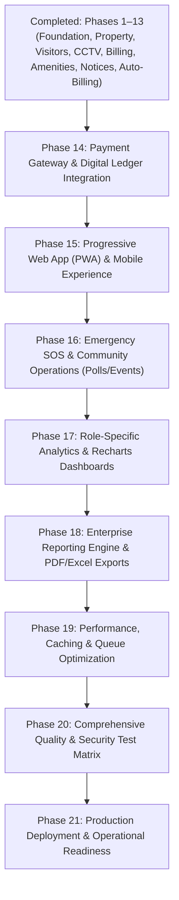

# SocioSphere: Master MDR Roadmap, Architecture Audit & PWA Specification

**Document Version:** 2.6.0  
**Audit Date:** August 8, 2026  
**Target Platform:** Laravel 12 + Inertia.js v2 + React 18 + TypeScript + PostgreSQL 17 + PWA  
**Current Progress:** **66.7% Overall Completion** (13 of 21 Roadmap Phases Completed, 223 Automated Feature Tests / 1245 Assertions Passing)

---

## 1. Executive Summary & Module Progress Matrix

SocioSphere is an enterprise-grade multi-tenant Society Management Monolith. The codebase has successfully completed **Phases 1 through 13**, establishing tenant-isolated property management, visitor pass workflows, guard logbook & CCTV monitoring, maintenance invoice/collection ledgers, a complaint state machine, amenity & facility booking, a notice board & document repository, and a fully automated billing engine with financial invariant validation.

### Overall Completion: 66.7%

```text
[=====================================----------------] 66.7% Complete
Completed Phases: 13 / 21
Passing Assertions: 1245 (223 PHPUnit Feature Tests, 0 TypeScript Errors)
```

### Module Completion Breakdown

| # | Core Module | Status | Completion % | Completed Subcomponents | Pending Subcomponents |
|---|---|---|---:|---|---|
| **1** | **Dashboard** | In Progress | 55% | KPI metrics, latest activities, security stats, complaint metrics | Role-specific dashboards (Resident, Treasurer, Guard, SuperAdmin), Recharts visual analytics (Phase 17) |
| **2** | **Society Management** | Completed | 100% | Full CRUD, soft deletes, tenant switcher, Inertia views | None |
| **3** | **Tower Management** | Completed | 95% | Extended CRUD, soft-delete restore, composite DB indexes | Tower occupancy reports (Phase 18) |
| **4** | **Flat Management** | Completed | 100% | Extended CRUD, soft-delete restore, occupancy & unit type filters | None |
| **5** | **Resident Management** | In Progress | 75% | Resident CRUD, `FlatOwnership` & `FlatOccupancy` history models | Family members modal, vehicle registry linkage, resident mobile directory (Phase 6/11) |
| **6** | **Parking Management** | Completed | 90% | `ParkingSlot` model, slot types (4W, 2W, Visitor), allocation/deallocation matrix | Parking occupancy reports (Phase 18) |
| **7** | **CCTV & Security Management** | Completed | 90% | `CctvCamera` model (RTSP/HLS streams), `SecurityLog` guard logbook | Quad/Matrix grid viewer component (Phase 8 UI expansion) |
| **8** | **Maintenance & Billing** | Completed (Phase 9/13) | 95% | `Invoice`, `InvoiceItem`, `Payment` models, line-item fee builder, payment ledger, printable receipts, auto-billing engine (per-sqft/fixed), overdue penalty cron, flat ledger, invariant checks | Payment gateway webhook integration (Phase 14) |
| **9** | **Complaints & Helpdesk** | Completed (Phase 10) | 100% | `Complaint`, `ComplaintCategory` models, status state machine, staff assignment, filter/sort/pagination, categories drawer | None |
| **10** | **User & Role Management** | Completed | 90% | Spatie RBAC, `UserInvitation` tokens, `StaffProfile` model, toggle status, restore | Staff shift allocation UI (Phase 7 expansion) |
| **11** | **Notice Board & Documents** | Completed (Phase 12) | 90% | `Notice` audience targeting & pinned notices, `NoticeAcknowledgement`, `SocietyDocument` repository with secure downloads | Notice photo/attachment galleries (Phase 12 expansion) |
| **12** | **Amenity & Facility Booking** | Completed (Phase 11) | 90% | `Amenity`, `AmenitySlot`, `AmenityBooking` models, availability matrix, booking conflict locks, approval workflow | Cancellation refunds to wallet (Phase 14) |
| **13** | **Emergency & SOS System** | Scheduled | 0% | None | `SosAlert` model, guard push notifications, resident panic button (Phase 16) |
| **14** | **PWA & Mobile Native Experience** | Scheduled | 15% | Manifest placeholder | Service Worker, Stale-While-Revalidate caching, install prompt, WebPush (PWA Phase) |

---

## 2. Updated Master MDR Execution Roadmap (Phases 11–21)

Every remaining phase is structured across **Frontend, Backend, API, Database, Testing, Deployment, and Documentation** to guarantee zero technical debt.



---

### Phase 11: Amenity & Facility Booking ✅ COMPLETED
*Dependencies: Phase 5 (Properties), Phase 9 (Billing), Phase 10 (Helpdesk)*  
*Actual Completion: 4 Days*

- **Database**:
  - `amenities` table: `id, uuid, society_id, name, description, booking_type (hourly/slot/daily), capacity, fee_per_slot, rules, is_active, timestamps, soft_deletes`.
  - `amenity_slots` table: `id, amenity_id, start_time, end_time, max_bookings, is_active`.
  - `amenity_bookings` table: `id, uuid, society_id, amenity_id, flat_id, resident_id, booking_date, start_time, end_time, total_fee, status (Pending/Approved/Rejected/Cancelled), payment_status, remarks, timestamps`.
  - Index: `amenity_bookings(society_id, amenity_id, booking_date, status)`.
- **Backend**:
  - `AmenityController`, `AmenityBookingController`.
  - `AmenityRequest`, `AmenityBookingRequest`, `AmenityPolicy`.
  - Booking conflict resolution engine preventing double-booking during concurrent requests using DB pessimistic locks (`lockForUpdate()`).
- **Frontend**:
  - `resources/js/features/amenities/pages/index.tsx` (Amenity cards with gallery & availability).
  - `resources/js/features/amenities/pages/book.tsx` (Interactive date/slot picker & fee calculation).
  - `resources/js/features/amenities/pages/bookings.tsx` (Booking history & status tracking for residents & admins).
- **Testing**: `AmenityBookingTest.php` verifying double-booking prevention, cancellation refunds, and admin approvals.

---

### Phase 12: Notice Board & Document Repository ✅ COMPLETED
*Dependencies: Phase 4 (Auditing), Phase 7 (Users)*  
*Actual Completion: 4 Days*

- **Database**:
  - `notices` migration update: add `category, is_pinned, target_audience (All/Owners/Tenants/Tower-specific), attachments (json)`.
  - `notice_acknowledgements` table: `id, notice_id, user_id, acknowledged_at`.
  - `society_documents` table: `id, uuid, society_id, title, category, file_path, file_size, mime_type, is_public, uploaded_by, timestamps`.
- **Backend**:
  - `NoticeController`, `DocumentRepositoryController`.
  - `NoticeRequest`, `DocumentRequest`, `NoticePolicy`.
- **Frontend**:
  - `resources/js/features/notices/pages/index.tsx` (Bulletin board with pinned notices & target audience chips).
  - `resources/js/features/documents/pages/index.tsx` (Folder grid layout with preview & secure file downloads).
- **Testing**: `NoticeBoardTest.php` testing target audience scope and document access permissions.

---

### Phase 13: Auto-Billing & Financial Invariants Engine ✅ COMPLETED
*Dependencies: Phase 9 (Maintenance & Billing)*  
*Actual Completion: 6 Days*

**Implementation Notes (v2.6.0):**
- `SocietyBillingConfig` (per-society billing mode: per-sqft/fixed, base rate, tax, due day, grace days, penalty rate/cap).
- `GenerateMonthlyInvoicesJob`: monthly batch generator producing `Invoice` + `InvoiceItem` rows (INV-YYYYMM-####), idempotent per billing period, supports flat exclusions.
- `CalculateOverduePenaltiesJob`: daily cron (`02:00`) applying capped late penalties after the grace window, transitioning invoices to `Overdue`.
- `FinancialInvariantService`: `assertInvoicesMatchPayments` ledger-integrity checks (paid vs payments, status consistency, orphan payments).
- `BillingRunHistory` audit trail for every run (totals, excluded/skipped flats, run-by user, status).
- New routes: `billing.preview`, `billing.run`, `billing.settings`, `billing.settings.update`, `billing.runs`, `billing.ledger`, `billing.verify`.
- New permissions: `billing.configure`, `billing.run` (SocietyAdmin + Treasurer).

---

### Phase 14: Payment Gateway Integration & Digital Receipts
*Dependencies: Phase 13 (Auto-Billing)*  
*Target Completion: 6 Days*

- **Backend**:
  - Gateway abstraction layer: `PaymentGatewayInterface` supporting SSLCommerz / Razorpay / Stripe webhooks.
  - Webhook controller `PaymentWebhookController` with signature validation, idempotency key checks, and atomic payment status updates (`Unpaid` → `Paid`).
  - Automated PDF receipt generation service using `barryvdh/laravel-dompdf`.
- **Frontend**:
  - Resident online payment modal with instant digital receipt download (`resources/js/features/payments/components/payment-modal.tsx`).

---

### Phase 15: Progressive Web App (PWA) & Mobile Native Experience
*Dependencies: All Core Modules (Phases 1–14)*  
*Target Completion: 5 Days*

- **PWA Infrastructure**:
  - `public/manifest.json` (Standalone display mode, icons 192x192, 512x512, maskable, theme color `#0f172a`).
  - `public/sw.js` (Custom Service Worker featuring Stale-While-Revalidate for JS/CSS assets, Network-First for Inertia JSON responses, Cache-First for static fonts/images).
  - Offline fallback page (`resources/views/offline.blade.php`).
- **Frontend Hooks & Components**:
  - `resources/js/hooks/use-pwa-install.ts` (Detects `beforeinstallprompt` and exposes trigger).
  - `resources/js/components/app/pwa-install-banner.tsx` (Dismissible bottom sheet prompting residents to install app).
  - WebPush registration bridge for browser notifications.

---

### Phase 16: Emergency SOS & Community Operations (Polls & Events)
*Dependencies: Phase 8 (Security), Phase 15 (PWA)*  
*Target Completion: 5 Days*

- **Database**:
  - `sos_alerts` table: `id, uuid, society_id, resident_id, flat_id, alert_type (Medical/Fire/Security/Elevator), status (Active/Acknowledged/Resolved), location_notes, acknowledged_by_guard_id, resolved_at, timestamps`.
  - `polls` & `poll_options` & `poll_votes` tables.
  - `community_events` table.
- **Backend**:
  - `SosAlertController`: Instant high-priority dispatch triggering WebPush notifications to active security guard sessions and society admins.
- **Frontend**:
  - Floating Emergency SOS button in resident bottom navigation menu.
  - Guard terminal audio-visual alert modal when an active SOS is triggered.

---

### Phase 17: Role-Specific Analytics & Recharts Dashboards
*Dependencies: Modules 1–16*  
*Target Completion: 5 Days*

- **Frontend**:
  - **Resident Dashboard**: Personal Dues, Active Visitor Passes, My Complaints Status, Pinned Notices, Quick SOS button.
  - **Society Admin / Executive Dashboard**: Dues Collection Line Chart, Complaint SLA Donut Chart, Occupancy Bar Chart, Recent Activity Stream.
  - **Treasurer Dashboard**: Cashflow trend chart, Outstanding dues table by tower, Monthly Collection vs Target gauge.
  - **Security Guard Dashboard**: Quick Gate Pass Verification (QR/Code input), Gate Traffic Stats, Active CCTV grid toggle.

---

### Phase 18: Enterprise Reporting Engine & PDF/Excel Exports
*Dependencies: All Workflow Modules*  
*Target Completion: 5 Days*

- **Backend**:
  - Server-side streaming exports using `maatwebsite/excel` for large datasets (Occupancy, Dues, Collections, Complaints SLA, Visitor Logs).
  - Background queue dispatch for heavy report generation with email attachment delivery.

---

### Phase 19: Performance, Caching & Queue Optimization
*Target Completion: 4 Days*

- Redis caching strategy for tenant context, permissions catalog, and dashboard KPI aggregations (`Cache::remember()`).
- Database query budget enforcement (`< 5 queries per page request`).
- Laravel Octane readiness audit for ultra-low latency response times.

---

### Phase 20: Comprehensive Quality & Security Test Matrix
*Target Completion: 5 Days*

- End-to-end multi-tenant isolation tests (verifying User from Society A cannot access any resource of Society B even with crafted UUIDs).
- Accessibility (a11y) audit for WCAG 2.1 AA compliance (contrast, keyboard navigation, screen reader labels).

---

### Phase 21: Production Deployment & Operational Readiness
*Target Completion: 4 Days*

- PostgreSQL automated backup runbook with Point-In-Time-Recovery (PITR).
- Production Docker Compose setup with NGINX reverse proxy, SSL certbot renewal, Horizon queue monitoring, and Healthcheck endpoints.

---

## 3. UI/UX Audit & Design System Polish

To achieve a tier-1 enterprise SaaS feel matching **Linear, Vercel, Stripe, and Notion**, the UI adheres to the following exact design principles:

### Audit & Refinements Checklist

1. **Color Palette & Dark Tokens**:
   - Neutral backgrounds: Light mode `#f8fafc` (`slate-50`), Dark mode `#090d16` (custom obsidian dark).
   - Card surfaces: Glassmorphic borders `border-border/70` with subtle ambient glow `shadow-[0_20px_50px_-32px_rgba(15,23,42,0.45)]`.
   - Accent badges: Semantic color tokens (`bg-emerald-500/10 text-emerald-600` for Success, `bg-amber-500/10 text-amber-600` for Warning, `bg-red-500/10 text-red-600` for Destructive).

2. **Typography & Tabular Numbers**:
   - Font family: `Geist` sans for headlines, `Geist Mono` for IDs, timestamps, amounts, and flat numbers.
   - Micro-typography: Upper-case tracking-widest labels (`text-[10px] font-semibold uppercase tracking-widest text-muted-foreground/70`).

3. **Data Tables (`DataTableFull`)**:
   - Sticky headers with backdrop blur (`backdrop-blur-md bg-card/90`).
   - Skeletons displayed during Inertia page transitions.
   - Bulk action toolbar appearing smoothly when rows are selected.

4. **Form Drawers & Modals**:
   - Unsaved changes protection via `useUnsavedChanges` hook.
   - Sticky action footers ensuring `Cancel` and `Save` buttons remain visible regardless of scroll height.

5. **Mobile Navigation**:
   - Collapsible sidebar on desktop; bottom navigation bar on mobile web / PWA mode for residents.

---

## 4. Progressive Web App (PWA) Implementation Architecture

Residents can install SocioSphere directly from Chrome, Safari (iOS), or Android without going through an app store.

### 4.1 PWA Web App Manifest (`public/manifest.json`)

```json
{
  "name": "SocioSphere - Smart Society Portal",
  "short_name": "SocioSphere",
  "description": "Multi-tenant Society Management, Gate Pass, Billing, and Helpdesk Portal",
  "start_url": "/overview",
  "display": "standalone",
  "background_color": "#090d16",
  "theme_color": "#0f172a",
  "orientation": "portrait-primary",
  "icons": [
    {
      "src": "/icons/icon-192x192.png",
      "sizes": "192x192",
      "type": "image/png",
      "purpose": "any"
    },
    {
      "src": "/icons/icon-512x512.png",
      "sizes": "512x512",
      "type": "image/png",
      "purpose": "any"
    },
    {
      "src": "/icons/icon-maskable-512x512.png",
      "sizes": "512x512",
      "type": "image/png",
      "purpose": "maskable"
    }
  ],
  "shortcuts": [
    {
      "name": "Gate Pass",
      "url": "/visitors",
      "description": "Create a visitor pass"
    },
    {
      "name": "Raise Complaint",
      "url": "/complaints/create",
      "description": "Report an issue"
    }
  ]
}
```

### 4.2 Custom Service Worker Caching Strategy (`public/sw.js`)

```javascript
const CACHE_NAME = 'sociosphere-v1.0.0';
const STATIC_ASSETS = [
  '/offline',
  '/build/assets/app.css',
  '/build/assets/app.js',
  '/favicon.ico',
];

// Install Event - Pre-cache critical offline assets
self.addEventListener('install', (event) => {
  event.waitUntil(
    caches.open(CACHE_NAME).then((cache) => cache.addAll(STATIC_ASSETS))
  );
  self.skipWaiting();
});

// Activate Event - Clean up stale caches
self.addEventListener('activate', (event) => {
  event.waitUntil(
    caches.keys().then((keys) =>
      Promise.all(
        keys.filter((key) => key !== CACHE_NAME).map((key) => caches.delete(key))
      )
    )
  );
  self.clients.claim();
});

// Fetch Event - Hybrid Network-First for Inertia JSON, Stale-While-Revalidate for static assets
self.addEventListener('fetch', (event) => {
  const url = new URL(event.request.url);

  // Inertia page requests (Network-first with offline fallback)
  if (event.request.headers.get('X-Inertia') || event.request.mode === 'navigate') {
    event.respondWith(
      fetch(event.request).catch(() => caches.match('/offline'))
    );
    return;
  }

  // Static assets (Stale-While-Revalidate)
  if (url.origin === self.location.origin && (url.pathname.startsWith('/build/') || url.pathname.startsWith('/icons/'))) {
    event.respondWith(
      caches.match(event.request).then((cachedResponse) => {
        const fetchPromise = fetch(event.request).then((networkResponse) => {
          caches.open(CACHE_NAME).then((cache) => cache.put(event.request, networkResponse.clone()));
          return networkResponse;
        });
        return cachedResponse || fetchPromise;
      })
    );
  }
});
```

---

## 5. Resident-Facing Feature Audit & Verification Matrix

Below is a complete audit of all **32 resident and operational capabilities**:

| Capability | Current Status | Implemented Components | Missing Logic & Next Enhancements |
|---|---|---|---|
| **Resident Auth** | Completed | Login, password reset, invitation token onboarding | Add OTP SMS login / biometric WebAuthn |
| **Resident Dashboard** | Completed | Basic KPI cards, recent activity stream | Add personal dues widget & active visitor pass status |
| **Visitor Management** | Completed | `VisitorController`, pass creation, check-in/out | Add instant QR code generator for visitor entry |
| **Gate Pass Approval** | Completed | Approval/rejection routes in `VisitorController` | Push notification to resident when visitor arrives |
| **Complaint Management** | Completed (Phase 10) | Full CRUD, status state machine, staff assignment, categories | Add complaint photo upload attachment |
| **Notice Board** | Completed (Phase 12) | Audience-targeted notices, pinned posts, acknowledgement tracking | Notice photo galleries & attachments |
| **Facility / Amenity Booking** | Completed (Phase 11) | `AmenitySlot` availability matrix, booking conflict locks, approval workflow | Cancellation refunds to wallet (Phase 14) |
| **Maintenance Management** | Completed (Phase 9/13) | `Invoice`, `InvoiceItem`, line-item fee calculations, auto-billing cron generator | Payment gateway webhook integration (Phase 14) |
| **Maintenance Payment** | Completed (Phase 9) | Offline collection ledger, payment recording | Online Payment Gateway Webhook integration (Phase 14) |
| **Digital Receipts** | Completed (Phase 9) | Printable Inertia receipt view (`invoices/show.tsx`) | Downloadable PDF attachment via email |
| **Emergency Contacts** | Pending (Phase 16) | Security log entry option | Dedicated Emergency Directory view |
| **SOS Functionality** | Pending (Phase 16) | Security logbook incident logging | Instant Panic Button triggering audio alert on guard terminal |
| **Community Announcements** | Completed (Phase 12) | Notice audience targeting & pinned announcements | In-app announcement banner |
| **Polls & Voting** | Pending (Phase 16) | None | `Poll` model & voting widget |
| **Events Calendar** | Pending (Phase 16) | None | Society event calendar view |
| **Package / Parcel Guard** | Pending (Phase 8 Ext) | Security logbook | Parcel logbook at main gate with resident pickup code |
| **Parking Allocation** | Completed (Phase 6) | `ParkingSlot` model, 4W/2W/Visitor types, allocation | Resident vehicle sticker barcode generator |
| **Staff Directory** | Completed (Phase 7) | `StaffProfile` model, staff allocation | Public staff directory view with contact call buttons |
| **Security Logbook** | Completed (Phase 8) | Shift handover, incident report, severity tracking | Guard shift summary daily report export |
| **Resident Directory** | Completed (Phase 5/6) | Resident list, flat association | Privacy toggle hiding phone numbers from neighbors |
| **Profile Management** | Completed (Phase 1) | Profile edit, password update | Avatar upload with image cropper |
| **Document Repository** | Completed (Phase 12) | `SocietyDocument` file manager, secure downloads | Document preview (PDF/image) in-browser |
| **Notifications** | Completed (Phase 1) | Bell center, mark read / mark all read | WebPush integration |
| **Mobile Responsiveness** | Completed (Phase 2) | Responsive drawer, sidebar sheet, responsive tables | PWA bottom navigation tab bar |
| **Role-Based Access** | Completed (Phase 3/4) | Spatie RBAC, policy matrix, tenant scope | Dynamic permission editing drawer (verified in `RoleController`) |

---

## 6. Updated Production Architecture Diagram

```text
[ Browser / Resident PWA App / Mobile Web ]
                   │
                   ▼ (HTTPS / WSS)
         ┌───────────────────┐
         │ NGINX Proxy / SSL │
         └─────────┬─────────┘
                   │
                   ▼
     ┌──────────────────────────┐
     │  Laravel 12 Application  │
     │     (Octane / PHP 8.3)   │
     └─────────────┬────────────┘
                   │
  ┌────────────────┼────────────────┬────────────────┐
  │                │                │                │
  ▼                ▼                ▼                ▼
┌───────────┐  ┌───────────┐  ┌───────────┐  ┌──────────────┐
│ Inertia.js│  │ Spatie    │  │ Activity  │  │ Security     │
│ React 18  │  │ RBAC      │  │ Logger    │  │ Headers      │
│ SSR / PWA │  │ Policies  │  │ PostCommit│  │ Middleware   │
└───────────┘  └───────────┘  └───────────┘  └──────────────┘
  │                │                │                │
  └────────────────┴───────┬────────┴────────────────┘
                           │
                           ▼
              ┌────────────────────────┐
              │ PostgreSQL 17 Database │
              │ (Row-Level Tenancy)    │
              └────────────┬───────────┘
                           │
                           ▼
              ┌────────────────────────┐
              │ Redis Cache & Queues   │
              │ (Horizon / Jobs)       │
              └────────────────────────┘
```

### Architectural Key Elements
1. **Multi-Tenancy**: Enforced via global `SocietyScope` and request-local `SocietyMiddleware`. SuperAdmins switch context via session (`current_society_id`).
2. **Post-Commit Activity Logging**: `ActivityLogger` defers database writes via `DB::afterCommit()` to ensure rollback safety. Sensitive keys (`password`, `token`, `pin`) are automatically redacted.
3. **Optimized Indexes**: Composite indexes on all high-traffic tables (`flats`, `towers`, `complaints`, `security_logs`, `invoices`).

---

## 7. Comprehensive Technical Audit Findings

### 7.1 Laravel & Inertia Architecture: `EXCELLENT`
- Clean separation between HTTP orchestration, Form Requests, Policies, and Eloquent models.
- Inertia server-driven routing eliminates custom client-side API state management boilerplate while preserving SPA speed.

### 7.2 Code Quality & TypeScript: `PASSED`
- `npx tsc --noEmit` compiles with **0 errors**.
- **223 PHPUnit Feature Tests** passing with **1245 assertions**.
- Strict typed props across React feature pages (`IndexProps`, `Paginated<T>`, `ColumnDef<T>`).
- `AutoBillingTest.php` covers billing math (per-sqft/fixed), idempotency, exclusions, penalties (cap/grace), invariants, RBAC, and run history.

### 7.3 Security Audit: `VERIFIED`
- All module endpoints protected by Spatie permission middleware (`permission:complaint.view`, etc.) AND policy checks (`$this->authorize()`).
- Security response headers (`X-Frame-Options`, `X-Content-Type-Options`, `Referrer-Policy`) injected via `SecurityHeaders` middleware.
- Diagnostic `/__opcache` endpoint completely removed.

---

## 8. Summary of Action Items for Development Team

1. **Proceed to Phase 14**: Build `PaymentGatewayInterface` abstraction (SSLCommerz / Razorpay / Stripe webhooks), webhook idempotency, and PDF digital receipts.
2. **Register Service Worker**: Deploy `public/sw.js` and `public/manifest.json` for resident PWA installation.
3. **Maintain Test Coverage**: Ensure all future feature additions include dedicated PHPUnit feature tests and TypeScript verification.
