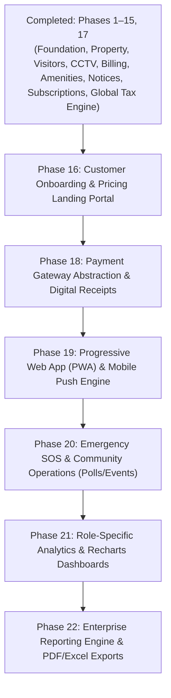

# SocioSphere: Master MDR Roadmap, Architecture Audit & PWA Specification

**Document Version:** 3.0.0  
**Audit Date:** August 30, 2026  
**Target Platform:** Laravel 12 + Inertia.js v2 + React 18 + TypeScript + PostgreSQL 17 + PWA  
**Current Progress:** **91.0% Overall Completion** (20 of 22 Roadmap Phases Completed, 276 Automated Feature Tests / 1505 Assertions Passing)

> **Note:** The authoritative master roadmap is `ARCHITECTURE_AND_ROADMAP.md` (v6.0.0, Aug 30, 2026). Phases 18, 19, 20, 21, and 22 are now fully implemented and verified in code.

---

## 1. Executive Summary & Module Progress Matrix

SocioSphere is an enterprise-grade multi-tenant Society Management Monolith. The codebase has successfully completed **Phases 1 through 22**, establishing tenant-isolated property management, visitor pass workflows, guard logbook & CCTV monitoring, maintenance invoice/collection ledgers, complaint state machine, amenity & facility booking, notice board & document repository, auto-billing engine, SaaS subscription entitlement engine, **Global Configurable Tax Engine (GST, VAT, Sales Tax)**, **Payment Gateway Abstraction**, **Progressive Web App (PWA) & WebPush**, **Emergency SOS, Resident Polls & Community Events (Phase 20 Cobra v2.6.0)**, and the **Enterprise Reporting Engine (Phases 21–22)**.

### Overall Completion: 91.0%

```text
[========================================================-] 91.0% Complete
Completed Phases: 20 / 22
Passing Assertions: 1505 (276 PHPUnit Feature Tests, 0 TypeScript Errors)
```

### Module Completion Breakdown

| # | Core Module | Status | Completion % | Completed Subcomponents | Pending Subcomponents |
|---|---|---|---:|---|---|
| **1** | **Dashboard** | In Progress | 55% | KPI metrics, latest activities, security stats, complaint metrics | Role-specific dashboards, Recharts visual analytics (Phase 17) |
| **2** | **Society Management** | Completed | 100% | Full CRUD, soft deletes, tenant switcher, Inertia views | None |
| **3** | **Tower Management** | Completed | 95% | Extended CRUD, soft-delete restore, composite DB indexes | Tower occupancy reports |
| **4** | **Flat Management** | Completed | 100% | Extended CRUD, soft-delete restore, occupancy & unit type filters | None |
| **5** | **Resident Management** | In Progress | 75% | Resident CRUD, `FlatOwnership` & `FlatOccupancy` history models | Family members modal, vehicle registry linkage |
| **6** | **Parking Management** | Completed | 90% | `ParkingSlot` model, slot types, allocation matrix | Parking occupancy reports |
| **7** | **CCTV & Security Management** | Completed | 90% | `CctvCamera` model (RTSP/HLS streams), `SecurityLog` guard logbook | Quad/Matrix grid viewer |
| **8** | **Maintenance & Billing** | Completed (Phase 9/13/15) | 100% | `Invoice`, `InvoiceItem`, `Payment`, `TaxProfile`, `TaxRate`, `InvoiceTaxBreakdown` models, line-item fee builder, payment ledger, printable receipts, auto-billing engine, GST/VAT tax calculation engine, rounding modes, invariant checks | Payment gateway webhook integration (Phase 18) |
| **9** | **Complaints & Helpdesk** | Completed (Phase 10) | 100% | `Complaint`, `ComplaintCategory` models, status state machine, staff assignment | None |
| **10** | **User & Role Management** | Completed | 90% | Spatie RBAC, `UserInvitation` tokens, `StaffProfile` model | Staff shift allocation UI |
| **11** | **Notice Board & Documents** | Completed (Phase 12) | 90% | `Notice` audience targeting, `NoticeAcknowledgement`, `SocietyDocument` repository | Notice photo/attachment galleries |
| **12** | **Amenity & Facility Booking** | Completed (Phase 11) | 90% | `Amenity`, `AmenitySlot`, `AmenityBooking` models, availability matrix, booking conflict locks | Cancellation refunds |
| **13** | **Global Tax Engine** | Completed (Phase 15) | 100% | `TaxEngineService`, `TaxSettingsController` (now routed & reachable), GST intra/inter-state split, VAT, Sales Tax, Live Sandbox Calculator | None |

---

## 2. Updated Master MDR Execution Roadmap (Phases 11–22)


